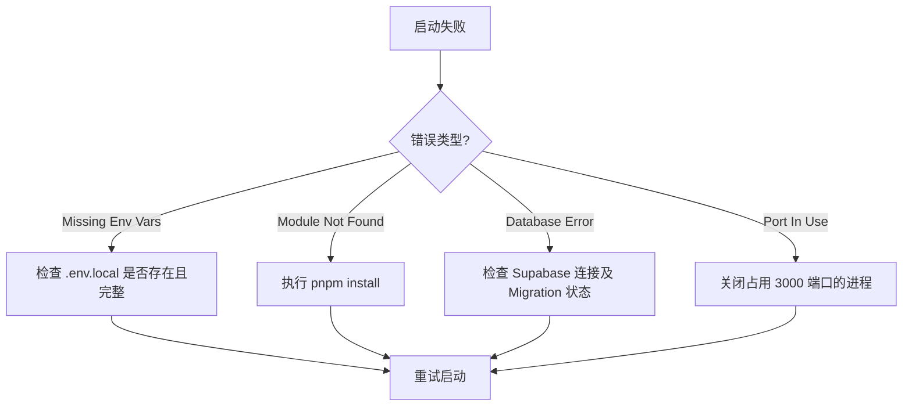
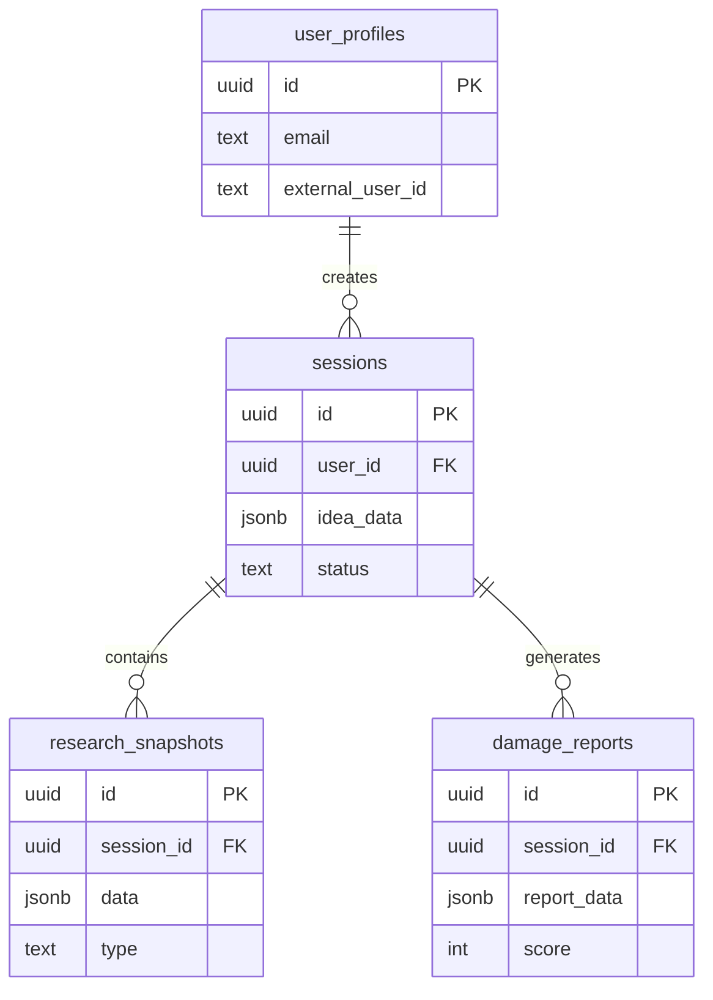
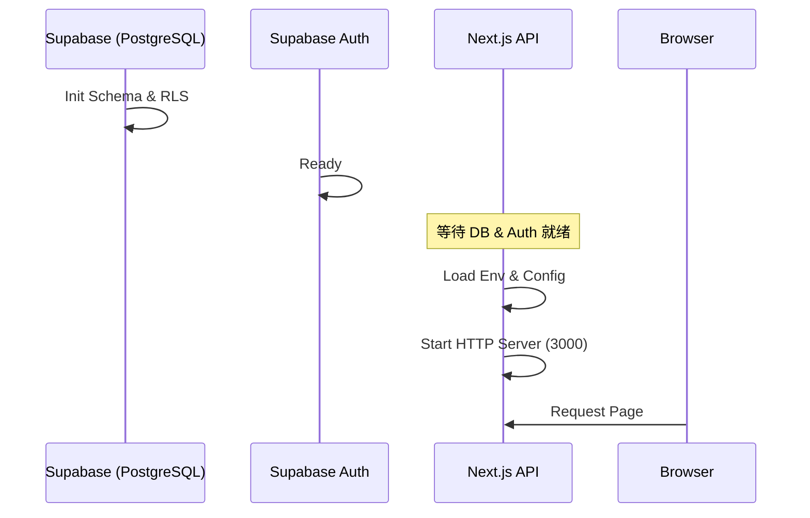
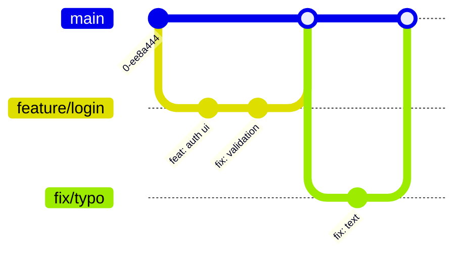

# Idea War Room - 项目全面深度解析指南

## 0. 整体技术架构与生态

### 0.1 核心技术栈 (Tech Stack)

Idea War Room 构建在现代全栈 TypeScript 生态之上，强调类型安全、开发效率与 AI 能力的深度集成。

- **Framework**: [Next.js 14 (App Router)](https://nextjs.org/) - 服务端渲染与 API 路由一体化。
- **Language**: TypeScript 5.x - 全链路类型安全。
- **Styling**: Tailwind CSS - 实用主义优先的原子化 CSS 框架。
- **Database & Auth**: [Supabase](https://supabase.com/) - 基于 PostgreSQL 的开源 Firebase 替代品，提供 Auth, DB, Vector, Edge Functions。
- **AI / LLM**:
  - **Models**: OpenAI (GPT-4o), Anthropic (Claude 3.5 Sonnet)。
  - **Orchestration**: 自研 Prompt Chain 与重试机制。
- **Testing**:
  - **Unit**: Vitest - 极速单元测试。
  - **E2E**: Playwright - 可靠的端到端测试。
- **Validation**: Zod - 运行时 Schema 校验。

### 0.2 系统架构图 (System Architecture)

```mermaid
graph TD
    User[User / Client] -->|HTTPS| Next[Next.js App Server]
    
    subgraph "Next.js Application Layer"
        Next -->|Render| Pages[React Server Components]
        Next -->|API Routes| API[Backend Logic]
    end
    
    subgraph "Data & Auth Layer (Supabase)"
        API -->|Query/RLS| DB[(PostgreSQL DB)]
        API -->|JWT| Auth[GoTrue Auth]
        DB -->|Vector Search| Embeddings[pgvector]
    end
    
    subgraph "Intelligence Layer"
        API -->|Prompt Chain| LLM[LLM Service (OpenAI/Claude)]
        API -->|Search| Search[Search Engine (Google/Bing)]
    end
    
    LLM -->|Analysis| API
    Search -->|Context| API
```

### 0.3 数据流向与交互模型

1. **用户意图 (Intent)**: 用户通过前端 Wizard 提交创意。
2. **数据持久化 (Persistence)**: 创意数据实时同步至 Supabase DB。
3. **信息增强 (Research)**: 后端触发 Search Engine 获取外部市场信息。
4. **智能分析 (Reasoning)**: 聚合内部数据与外部信息，投喂给 LLM 进行 MVTA 分析。
5. **结果交付 (Delivery)**: 生成结构化报告，通过 SSR/CSR 呈现给用户。

---

## 1. 五种对抗人格类型定义 (Red Team Personas)

项目核心的 MVTA (Multi-Vector Threat Analysis) 引擎通过 Prompt Engineering 模拟了 5 位顶级专家组成的 "红队"，每位专家负责一个特定的威胁向量。以下是详细的人格定义：

### 1.1 Lead Penetration Tester (首席渗透测试专家)

- **负责向量**: **Technical & Product Integrity (技术与产品完整性)**
- **核心特征**:
  - 极度理性，数据驱动，只相信可复现的证据。
  - 关注系统边缘情况 (Edge Cases) 和压力极限。
  - 不仅关注代码 Bug，更关注业务逻辑漏洞和架构缺陷。
- **行为模式**:
  - **Scalability Stress Test**: 模拟用户量激增 100 倍时的系统表现。
  - **Supply Chain Poisoning**: 审查依赖库和第三方服务的安全隐患。
  - **Usability Failure**: 寻找导致用户流失的糟糕交互流程。
- **交互偏好**:
  - **语言风格**: 冷酷、直接、技术化。
  - **关注点**: "这在负载下会崩溃吗？" "数据流是否安全？"

### 1.2 Ruthless Competitor CEO (冷酷竞争对手 CEO)

- **负责向量**: **Market & Economic Viability (市场与经济生存力)**
- **核心特征**:
  - 唯利是图，拥有毒辣的战略眼光。
  - 擅长利用资本优势、渠道优势和品牌壁垒碾压新入局者。
  - 对 "情怀" 嗤之以鼻，只看 ROI 和护城河。
- **行为模式**:
  - **Entrenched Competitors Crushing**: 制定价格战或排他性协议策略。
  - **Value Proposition Doubt**: 攻击产品的核心价值主张是否伪需求。
  - **Customer Apathy Spiral**: 预测用户尝鲜后的冷漠反应。
- **交互偏好**:
  - **语言风格**: 傲慢、轻视、充满商业黑话 (LTV, CAC, Moat)。
  - **关注点**: "我如何用 1/10 的成本复制你？" "你的利润空间在哪里？"

### 1.3 Skeptical Social Critic (怀疑论社会评论家)

- **负责向量**: **Social & Ethical Resonance (社会与伦理共鸣)**
- **核心特征**:
  - 高度敏感，关注社会正义、公平性和潜在的歧视。
  - 擅长发现产品可能带来的负面社会外部性 (Negative Externalities)。
  - 代表弱势群体和边缘化用户的视角。
- **行为模式**:
  - **Malicious Misuse at Scale**: 预判产品被坏人利用的后果。
  - **Cancel Culture Vulnerability**: 评估品牌被舆论抵制的风险。
  - **Ethical Slippery Slope**: 警告算法偏见或成瘾机制的设计。
- **交互偏好**:
  - **语言风格**: 尖锐、充满道德审视、情绪化。
  - **关注点**: "这对社会有什么好处？" "谁会被这个系统伤害？"

### 1.4 Cynical Regulatory Officer (愤世嫉俗的合规官)

- **负责向量**: **Legal & Regulatory Compliance (法律与监管合规)**
- **核心特征**:
  - 极度保守，厌恶风险 (Risk-Averse)。
  - 精通法律条文，特别是 GDPR、CCPA、HIPAA 等数据法规。
  - 总是假设最坏的法律后果和巨额罚款。
- **行为模式**:
  - **Regulatory Loopholes Closing**: 警告当前的监管套利窗口即将关闭。
  - **Jurisdictional Conflicts**: 分析跨国运营的法律冲突。
  - **Compliance Cost Explosion**: 计算合规所需的隐性成本。
- **交互偏好**:
  - **语言风格**: 严谨、教条、引用法条条款。
  - **关注点**: "这合规吗？" "如果被起诉，我们能赢吗？"

### 1.5 Master Political Strategist (资深政治策略家)

- **负责向量**: **Narrative & Political Weaponization (叙事与政治武器化)**
- **核心特征**:
  - 操控大师，洞察公众情绪和群体心理。
  - 擅长利用两极分化 (Polarization) 和身份政治。
  - 将商业竞争上升到意识形态或国家安全层面。
- **行为模式**:
  - **Malicious Reframing**: 将产品特性恶意解读为某种政治阴谋。
  - **Political Polarization**: 利用社会裂痕制造对立。
  - **Moral Panic Triggers**: 触发公众的道德恐慌。
- **交互偏好**:
  - **语言风格**: 宏大叙事、阴谋论视角、煽动性。
  - **关注点**: "公众会怎么看这个？" "这会被贴上什么标签？"

---

## 2. 核心模块及子模块划分

系统采用模块化设计，主要分为前端交互、后端服务、智能引擎和数据存储四大层级。

| 核心模块 | 子模块 | 功能描述 | 关键文件位置 |
| :--- | :--- | :--- | :--- |
| **Idea Intake**(创意录入) | **Wizard Flow** | 3步向导式表单，管理录入进度与状态流转 | `app/analyze/[id]/intake/` |
| | **Validation** | 基于 Zod 的实时字段校验与字符限制 | `src/lib/validation/schemas.ts` |
| | **Auto-Save** | 本地存储防丢失机制 (Debounce 2s) | `src/components/IntakeWizard.tsx` |
| **Research Engine**(研究引擎) | **Query Gen** | 基于创意自动生成针对性搜索关键词 | `src/lib/llm/prompts/generate-queries.ts` |
| | **Search Client** | 多源搜索结果抓取与聚合 (Google/Bing/Reddit) | `src/lib/search/client.ts` |
| | **Synthesis** | 搜索结果的智能摘要、清洗与去重 | `src/lib/llm/prompts/synthesize-research.ts` |
| **MVTA Simulation**(红蓝对抗) | **Red Team** | 5种对抗人格模拟攻击，并行生成分析 | `src/lib/llm/prompts/mvta-analysis.ts` |
| | **Scoring** | 1-5分制漏洞评分系统 (Catastrophic to Resilient) | `src/lib/llm/client.ts` |
| | **Cascading** | 级联失效链路分析 (Trigger -> Chain -> Impact) | `src/lib/llm/prompts/mvta-analysis.ts` |
| **Session Management**(会话管理) | **Lifecycle** | 会话创建、状态更新、过期清理 | `app/api/sessions/` |
| | **Quota** | 用户配额检查与限制 | `app/api/sessions/quota/` |
| | **Auth** | Supabase JWT 验证与用户上下文注入 | `src/lib/auth/session.ts` |
| **Report System**(报告系统) | **Generation** | 结构化 Markdown 报告生成与渲染 | `app/analyze/[id]/report/` |
| | **Visualization** | 风险雷达图/仪表盘组件 | `src/components/charts/` |
| | **Export** | 报告导出与分享链接生成 | `src/lib/utils/export.ts` |

---

## 3. 完整目录结构规范

```bash
idea-war-room/
├── .env.local.example          # 环境变量示例文件 (Supabase & AI Keys)
├── .eslintrc.json              # ESLint 代码检查配置
├── .prettierrc                 # Prettier 代码格式化配置
├── next.config.js              # Next.js 构建配置
├── package.json                # 项目依赖与脚本管理
├── tsconfig.json               # TypeScript 编译配置
├── vitest.config.ts            # 单元测试配置
├── playwright.config.ts        # E2E 测试配置
├── app/                        # [App Router] 核心应用逻辑
│   ├── api/                    # 后端 API 路由 (Serverless Functions)
│   │   ├── auth/               # 认证相关
│   │   │   ├── callback/       # OAuth 回调处理
│   │   │   ├── logout/         # 登出处理
│   │   │   └── session/        # 获取当前会话信息
│   │   ├── sessions/           # 业务会话管理
│   │   │   ├── create/         # 创建新分析会话
│   │   │   ├── quota/          # 配额检查
│   │   │   └── [sessionId]/    # 特定会话操作
│   │   │       ├── analyze/    # 触发分析任务
│   │   │       ├── idea/       # 读取/保存创意数据
│   │   │       ├── report/     # 获取最终报告
│   │   │       ├── research/   # 获取研究数据
│   │   │       └── status/     # 轮询任务状态
│   ├── analyze/                # 分析流程前端页面
│   │   └── [sessionId]/        # 动态路由
│   │       ├── intake/         # 创意录入 (Wizard)
│   │       ├── choice/         # 确认分析方向
│   │       ├── research/       # 研究进度展示
│   │       └── report/         # 报告展示页
│   ├── dashboard/              # 用户控制台 (历史记录列表)
│   ├── layout.tsx              # 全局布局 (Providers, Header)
│   └── page.tsx                # 营销落地页
├── src/                        # 源代码目录
│   ├── components/             # React 组件库
│   │   ├── ui/                 # 基础 UI 组件 (Button, Input, etc.)
│   │   └── charts/             # 可视化图表组件
│   ├── contexts/               # React Context
│   │   ├── AuthContext.tsx     # 用户登录状态管理
│   │   └── I18nContext.tsx     # 多语言状态管理
│   ├── i18n/                   # 国际化资源
│   │   └── locales/            # JSON 语言包 (en.json, zh.json)
│   ├── lib/                    # 核心工具库
│   │   ├── auth/               # 认证逻辑 (JWT解析, Cookie管理)
│   │   ├── constants/          # 全局常量 (配额限制, 提示词配置)
│   │   ├── llm/                # LLM 交互层
│   │   │   ├── client.ts       # API 客户端 (Retry, Error Handling)
│   │   │   └── prompts/        # [Prompt Store] 提示词定义
│   │   ├── search/             # 搜索服务层
│   │   │   ├── client.ts       # Search API 客户端
│   │   │   └── research-engine.ts # 研究任务编排
│   │   ├── supabase/           # Supabase 客户端单例
│   │   └── validation/         # Zod Schemas 数据验证
│   └── styles/                 # 全局样式
│       └── globals.css         # Tailwind CSS 入口
├── specs/                      # [SDD] 项目规格说明书
│   ├── features/               # 功能规格 (F-XX)
│   ├── system/                 # 系统规格 (S-XX)
│   └── archive/                # 历史归档
├── supabase/                   # Supabase 数据库配置
│   └── migrations/             # SQL 迁移脚本
└── tests/                      # 测试套件
    ├── e2e/                    # Playwright 端到端测试
    └── unit/                   # Vitest 单元测试
```

---

## 4. 项目启动指南扩展

### 4.1 环境配置要求

- **Runtime**: Node.js >= 18.17.0 (推荐 v20 LTS)
- **Package Manager**: pnpm >= 8.x (锁定版本: `pnpm@10.15.1`)
- **Database**: PostgreSQL 15+ (via Supabase)

### 4.2 多环境启动参数

项目通过 `.env` 文件区分环境。

- **Development (开发)**:

  ```bash
  # 使用 .env.local
  pnpm dev
  ```

- **Testing (测试)**:

  ```bash
  # 使用 .env.test (需自行创建)
  pnpm test        # 运行单元测试
  pnpm test:e2e    # 运行 E2E 测试
  ```

- **Production (生产)**:

  ```bash
  # 构建并启动
  pnpm build
  pnpm start
  ```

### 4.3 常见启动问题排查



---

## 5. 数据库初始化增强

### 5.1 数据表关联关系 (ERD)



### 5.2 示例测试数据生成

无需额外脚本，可通过 SQL 直接插入种子数据 (Seed Data)：

```sql
-- 在 Supabase SQL Editor 中执行
INSERT INTO user_profiles (id, email, external_user_id, full_name)
VALUES 
  ('00000000-0000-0000-0000-000000000000', 'test@example.com', 'test_user_123', 'Test User');

INSERT INTO sessions (user_id, status, idea_data)
VALUES 
  ('00000000-0000-0000-0000-000000000000', 'completed', '{"high_concept": "Uber for Dogs"}');
```

### 5.3 数据迁移与版本升级

使用 Supabase CLI 进行管理：

1. **创建迁移**: `supabase db diff -f add_new_column`
2. **应用迁移 (本地)**: `supabase db reset` (注意：会清空本地数据)
3. **应用迁移 (生产)**: 推送至 Git，由 CI/CD 自动执行 `supabase db push`。

---

## 6. 服务启动方式完善

### 6.1 服务依赖启动顺序



### 6.2 服务健康检查

- **Endpoint**: `/api/sessions/[sessionId]/status`
- **用途**: 前端轮询此接口以获取分析任务的实时进度 (pending -> researching -> analyzing -> completed)。
- **响应示例**:

  ```json
  {
    "status": "analyzing",
    "progress": 66,
    "step": "mvta_simulation"
  }
  ```

### 6.3 监控与日志

- **Logging**: 使用 `console.log/error` (在 Serverless 环境中会被自动收集到 CloudWatch 或 Vercel Logs)。
- **Error Tracking**: 建议集成 Sentry (目前未集成，需在 `next.config.js` 中配置)。
- **Metrics**: 关注 Vercel Dashboard 中的 "Function Invocation Time" 和 "Duration"。

---

## 7. 开发方法论深化

### 7.1 代码审查 Checklist

- [ ] **Type Safety**: 是否有 `any` 类型？Zod Schema 是否覆盖了所有外部输入？
- [ ] **Security**: 是否检查了 RLS 策略？是否在 Client Component 中暴露了敏感 Key？
- [ ] **Performance**: 是否有不必要的 Re-render？API 调用是否并行化 (Promise.all)？
- [ ] **Testing**: 核心逻辑是否有单元测试？新功能是否有 E2E 测试？
- [ ] **Standards**: 变量命名是否符合规范？Prompt 是否遵循 JSON 输出模式？

### 7.2 分支管理策略



- **main**: 保护分支，仅允许 PR 合并。
- **feature/**: 功能开发分支。
- **fix/**: Bug 修复分支。

### 7.3 自动化测试标准

基于 `vitest.config.ts` 的配置：

- **Lines**: > 70%
- **Functions**: > 70%
- **Branches**: > 70%
- **Statements**: > 70%
- **关键路径覆盖**: 必须覆盖 `src/lib/llm` 和 `src/lib/search` 下的核心逻辑。

---

## 8. AI Prompt Engineering 实战指南

### 8.1 Prompt 开发五步法 (The 5-Step Framework)

在本项目中，开发一个新的 AI 功能（如“生成搜索关键词”或“红队攻击分析”）时，请严格遵循以下步骤：

#### Step 1: 定义任务 (Task Definition)

明确 AI 到底要解决什么问题。

- **Bad**: "让 AI 分析一下这个创意。" (太模糊)
- **Good**: "扮演安全专家，找出该创意在数据隐私方面的 3 个潜在漏洞，并给出评分 (1-5)。"

#### Step 2: 构建上下文 (Context Construction)

确定 AI 需要哪些输入数据才能完成任务。在代码中，这对应 `variables`。

- **输入数据**: 创意名称、描述、搜索到的竞品信息、用户目标受众等。
- **数据清洗**: 移除 HTML 标签、截断过长文本以节省 Token。

#### Step 3: 设计 System Prompt (Role & Instructions)

编写 `src/lib/llm/prompts/xxx.ts`。

- **Role (角色)**: "You are a Chief Security Officer..."
- **Goal (目标)**: "Your goal is to identify security risks..."
- **Constraints (约束)**: "Be concise. Do not use markdown. Use professional tone."
- **Chain of Thought (思维链)**: "First, analyze the data flow. Then, identify weak points. Finally, output the JSON."

#### Step 4: 定义输出契约 (Schema Definition)

使用 Zod 定义严格的 JSON 输出格式。**这是工程化的关键。**

- 必须开启 `response_format: { type: 'json_object' }`。
- 在 Prompt 末尾明确：`Output ONLY valid JSON matching this schema: ...`

#### Step 5: 测试与迭代 (Evaluation)

不要直接写进业务代码，先用脚本测试。

- 使用 `scripts/test-prompt.ts` 运行 Prompt。
- **Checklist**:
  - 格式是否总是合法的 JSON？
  - 内容是否出现了幻觉 (Hallucination)？
  - 语气是否符合人格设定？

### 8.2 Prompt 分类与示例

#### Analysis Prompts (分析类)

- **文件**: `src/lib/llm/prompts/mvta-analysis.ts`
- **特点**: 复杂的 System Role，包含具体的评分标准和攻击向量定义。
- **示例**:

  ```typescript
  const SYSTEM_PROMPT = \`You are an AI Red Team...
  Output ONLY valid JSON matching this schema:
  { "vulnerabilities": [...] }\`;
  ```

#### Generation Prompts (生成类)

- **文件**: `src/lib/llm/prompts/generate-queries.ts`
- **特点**: 任务单一，要求输出精确的搜索关键词列表。
- **反模式**: 要求 AI "解释为什么选择这些词" (会破坏 JSON 结构)。

#### Synthesis Prompts (综合类)

- **文件**: `src/lib/llm/prompts/synthesize-research.ts`
- **特点**: 输入大量文本 (Context Window)，要求提取事实，去重。

### 8.3 Prompt 调试与优化

1.  **Logging**: 在 `src/lib/llm/client.ts` 中开启 `console.log`，查看完整的 Prompt 拼接结果和 Token 数估算。
2.  **Temperature Tuning**:
    - 分析/提取任务 (Extraction): 0.0 - 0.3
    - 创意/生成任务 (Creative): 0.7 - 1.0 (GPT-5 锁定为 1.0)
3.  **JSON Mode**: 始终开启 `response_format: { type: 'json_object' }` 并提供 Schema。

---

## 9. Spec-Driven Development (SDD) 实战指南

### 9.1 什么是 Spec 编程？

Spec 编程 (SDD) 的核心理念是 **"Coding is the last step"**。在写下一行代码之前，必须先在文档中解决所有不确定性。这能避免 "写了一半发现逻辑走不通" 的低效返工。

### 9.2 Spec 编写四步法 (The SDD Process)

#### Step 1: 明确问题 (Understand)

- **动作**: 与 PM 或用户沟通，弄清楚 "为什么要做这个功能？"
- **产出**: Spec 中的 `1. Background` 章节。

#### Step 2: 定义接口 (Define Interface)

- **动作**: 设计 API 的 URL、参数、返回值；设计数据库表结构。
- **工具**: 使用 TypeScript Interface 或 Zod Schema 描述数据结构。
- **产出**: Spec 中的 `4. Technical Solution` (Schema & API 部分)。

#### Step 3: 设计交互 (Design Interaction)

- **动作**: 想象用户如何使用该功能。画出流程图或时序图。
- **工具**: Mermaid.js。
- **产出**: Spec 中的 `3. User Experience` 章节。

#### Step 4: 评审与定稿 (Review & Finalize)

- **动作**: 将 Spec 发给团队评审。
- **标准**: 开发人员看到 Spec 应该能直接写出代码，而不需要再问 "这里该怎么处理？"。

### 9.3 实战模板 (RFC Template)

**文件路径**: `specs/features/F-XX-feature-name.md`

```markdown
# F-XX: Feature Name

**Version**: 1.0
**Status**: Draft
**Owner**: [Name]

## 1. Background
(Context, Problem, Goals)

## 2. Requirements
- Functional: User can do X.
- Non-Functional: Response time < 2s.

## 3. User Experience
(User Flow Mermaid Diagram)

## 4. Technical Solution
- **API**: POST /api/x
- **Schema**: Update Table Y
- **Security**: RLS Policy Z

## 5. Verification
- Test Case 1: ...
```

### 9.4 版本变更记录格式

```markdown
## Change Log
- **v1.1 (2025-01-01)**: Added validation logic. (Author)
- **v1.0 (2024-12-31)**: Initial Draft. (Author)
```

---

## 10. 开发工作流演示

本章节通过还原真实的开发场景，详细展示从需求分析到部署上线的完整生命周期。

### 10.1 标准开发全流程 (The SDD Workflow)

项目严格遵循 **Spec-Driven Development (SDD)** 模式，确保"先想清楚，再动手写"。

| 阶段 | 关键活动 | 输入 (Input) | 输出 (Output) | 负责人 |
| :--- | :--- | :--- | :--- | :--- |
| **1. Spec** | 编写 RFC 文档，定义功能范围与技术方案 | 用户需求 / Issue | `specs/features/F-XX.md` | PM / Engineer |
| **2. Review** | 团队评审 Specs，确认可行性与排期 | Draft Spec | Approved Spec | Tech Lead |
| **3. Plan** | 拆解任务，创建 Git 分支 | Approved Spec | JIRA Tasks / Branch | Engineer |
| **4. Code** | 编写代码，实现功能与测试 | Spec & Tasks | PR (Pull Request) | Engineer |
| **5. Verify** | 自动化测试 (CI) 与人工验收 | PR | Passed Pipeline | CI / QA |
| **6. Deploy** | 合并主分支，自动部署 | Merged PR | Live Feature | Vercel |

### 10.2 全生命周期场景演示：新增 "智能简报导出" 功能 (Smart Brief Export)

以下演示如何在 Idea War Room 中从零实现 **F-05: Smart Brief Export** 功能。该功能不仅导出 PDF，还需调用 LLM 生成一份 "高管摘要 (Executive Summary)"。

#### 阶段 1: 需求与设计 (Spec & Design)

1. **创建分支**:

    ```bash
    git checkout -b feature/smart-export
    ```

2. **编写 Spec**: 创建 `specs/features/F-05-smart-export.md`

    ```markdown
    # F-05: Smart Brief Export
    ## Requirements
    - 用户点击 "Export Brief"。
    - **AI 任务**: 总结 5 个维度的威胁，生成 200 字的高管摘要。
    - **系统任务**: 生成包含摘要和图表的 PDF。
    ## Data Schema
    - Input: `SessionId`
    - Output: PDF Buffer
    ```

#### 阶段 2: 数据模式定义 (Schema Definition)

在编写业务逻辑前，优先定义数据契约，确保类型安全。

1. **定义 Zod Schema** (`src/lib/validation/schemas.ts`):

    ```typescript
    import { z } from 'zod';

    // API 请求验证
    export const exportBriefSchema = z.object({
      sessionId: z.string().uuid({ message: "Invalid Session ID" }),
      language: z.enum(['en', 'zh']).default('en'),
      includeCharts: z.boolean().default(true)
    });

    // LLM 输出结构验证 (Structured Output)
    export const executiveSummarySchema = z.object({
      risk_level: z.enum(['CRITICAL', 'HIGH', 'MEDIUM', 'LOW']),
      key_findings: z.array(z.string()).length(3),
      actionable_advice: z.string().max(300)
    });

    export type ExportBriefInput = z.infer<typeof exportBriefSchema>;
    ```

#### 阶段 3: Prompt 工程 (Prompt Engineering)

核心难点在于让 LLM 准确总结复杂的红队分析报告。

1. **编写 Prompt** (`src/lib/llm/prompts/generate-summary.ts`):

    ```typescript
    export const GENERATE_SUMMARY_PROMPT = `
    You are a Chief Security Officer summarizing a Red Team report for the CEO.
    
    Context:
    - Project: {{idea_name}}
    - Threat Analysis: {{mvta_results}}
    
    Task:
    1. Determine the overall Risk Level.
    2. Extract top 3 most critical vulnerabilities.
    3. Provide one concise actionable advice.
    
    Output Format: JSON matching the schema.
    `;
    ```

2. **调试 Prompt**: 使用 `scripts/test-prompt.ts` 进行单测。
    - *Input*: 模拟的 MVTA JSON 数据。
    - *Iteration 1*: AI 输出过于啰嗦 -> **Fix**: 增加 "concise" 和 "max 300 chars" 约束。
    - *Iteration 2*: 忽略了 JSON 格式 -> **Fix**: 强制开启 `response_format: { type: 'json_object' }`。

#### 阶段 4: 数据库变更 (Database Migration)

1. **生成 Migration**:

    ```bash
    supabase migration new add_export_logs
    ```

2. **编写 SQL** (`supabase/migrations/20240122000000_add_export_logs.sql`):

    ```sql
    create table export_logs (
      id uuid default gen_random_uuid() primary key,
      session_id uuid references sessions(id),
      summary_generated jsonb, -- 存储 AI 生成的摘要
      created_at timestamptz default now()
    );
    ```

#### 阶段 5: 核心功能开发 (Implementation)

1. **后端 API (`app/api/export/route.ts`)**:

    ```typescript
    import { exportBriefSchema, executiveSummarySchema } from '@/lib/validation/schemas';
    import { callLLM } from '@/lib/llm/client';
    import { GENERATE_SUMMARY_PROMPT } from '@/lib/llm/prompts/generate-summary';
    
    export async function POST(req: Request) {
      // 1. Input Validation
      const body = await req.json();
      const { sessionId } = exportBriefSchema.parse(body);
      
      // 2. Fetch Context
      const session = await supabase.from('sessions').select('*').eq('id', sessionId).single();
      
      // 3. AI Generation (Prompt Chain)
      const summaryJson = await callLLM({
        messages: [{ role: 'system', content: GENERATE_SUMMARY_PROMPT }],
        variables: { idea_name: session.idea, mvta_results: session.data },
        schema: executiveSummarySchema // 确保输出符合 Zod 定义
      });
      
      // 4. PDF Generation & Logging
      const pdfBuffer = await generatePDF(session, summaryJson);
      await supabase.from('export_logs').insert({ session_id: sessionId, summary_generated: summaryJson });
      
      return new Response(pdfBuffer, { headers: { 'Content-Type': 'application/pdf' } });
    }
    ```

#### 阶段 6: 质量保障与测试 (QA & Testing)

1. **单元测试 (`tests/unit/prompt.test.ts`)**:

    ```typescript
    test('Summary Prompt produces valid JSON', async () => {
      const result = await callLLM({ ... });
      // 验证 LLM 输出是否符合 Schema
      expect(() => executiveSummarySchema.parse(result)).not.toThrow();
    });
    ```

2. **E2E 测试 (`tests/e2e/export.spec.ts`)**:
    模拟用户点击 -> 等待 API 响应 -> 验证下载的文件类型。

#### 阶段 7: 部署与运维 (Deployment & Ops)

1. **提交代码**: `git push origin feature/smart-export`
2. **CI 检查**: 确保 Schema 校验通过，Prompt 测试无 Hallucination。
3. **合并上线**: Vercel 自动部署。

### 10.3 常见问题与解决方案 (Troubleshooting)

| 问题场景 | 典型表现 | 解决方案 |
| :--- | :--- | :--- |
| **Migration Conflict** | `supabase db push` 失败，提示 schema 不一致 | 使用 `supabase db pull` 同步远程结构，或手动解决 SQL 文件冲突。 |
| **Env Missing** | 部署后 API 报错 500 | 检查 Vercel 项目设置，确保 `.env.local` 中的 Key (如 `OPENAI_API_KEY`) 已同步到生产环境变量。 |
| **Edge Function Timeout** | PDF 生成超过 10s 导致超时 | 将耗时任务移至后台队列 (Supabase Edge Functions / QStash)，前端改为轮询状态。 |
