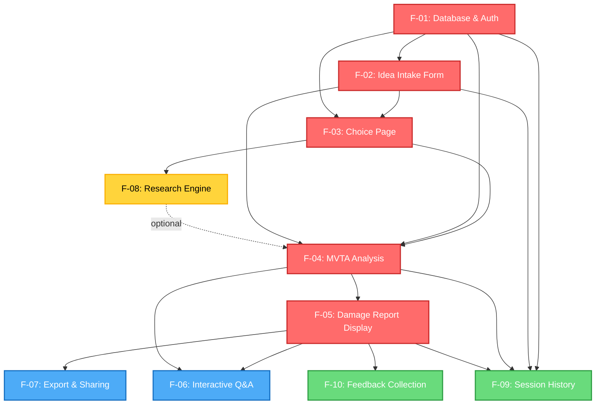

# Idea War Room - Specifications

**Version**: 1.0
**Last Updated**: 2025-12-08
**Methodology**: Spec-Driven Development (SDD)

---

## Navigation Guide

### For AI Coding Agents

**Start here before writing any code:**

1. **Understand the Architecture** → Read [system/S-00-architecture.md](./system/S-00-architecture.md)
2. **Review System Design** → Browse [system/](#system-design) directory (S-01 through S-05)
3. **Choose a Feature** → Explore [features/](#features) directory (F-01 through F-09)
4. **Follow Implementation Waves** → See [Feature Dependency Graph](#feature-dependency-graph)

### For Human Developers

**Quick orientation:**

- **What is this product?** → See [Product Overview](#product-overview) below
- **How is it organized?** → See [Directory Structure](#directory-structure)
- **Where do I start?** → See [Reading Order](#reading-order)
- **What's the implementation plan?** → See [Feature Dependency Graph](#feature-dependency-graph) and [Implementation Waves](#implementation-waves)

---

## Product Overview

**Idea War Room** is an AI-powered platform that helps founders validate startup ideas through Multi-Vector Threat Analysis (MVTA). The system simulates professional red-team attacks across 5 threat vectors, backed by real-world research from online communities and competitor analysis.

### Problem

Founders rarely get structured, multi-angle, evidence-backed pushback on new ideas. Most AI chats are "yes-men," and human feedback is ad hoc, slow, and rarely grounded in real user conversations or systematic threat analysis.

### Solution

An interactive MVTA "war room" that:
1. Captures founder's idea in structured format
2. Conducts automated research (competitors, Reddit, forums, reviews)
3. Simulates 5 adversarial roles attacking the idea across 18+ attack vectors
4. Generates a "Damage Report" with vulnerability scoring (1-5 scale)
5. Identifies cascading failure chains
6. Provides actionable mitigation recommendations

### Target Users

- Early-stage founders and indie hackers
- Solo builders and small teams pre-MVP or pre-launch
- Accelerator applicants and student teams
- Strategy/product professionals exploring new features or bets

### Session Flow (30-45 minutes)

```
User submits idea
  ↓
System structures idea into MVTA format (Prompt A)
  ↓
Research engine fetches competitor & community data (15-30 sec)
  ↓
MVTA Red Team simulation runs (5 AI personas attack) (30-60 sec)
  ↓
Damage Report displayed (vulnerabilities, cascading failures, recommendations)
  ↓
User asks follow-up questions (optional)
  ↓
User exports report (markdown)
```

---

## Directory Structure

```
specs/
├── README.md                           # This file - Navigation guide
│
├── system/                             # System design (shared across features)
│   ├── S-00-architecture.md            # System architecture overview
│   ├── S-01-uiux-design.md             # UI/UX design system
│   ├── S-02-testing-strategy.md        # Testing strategy & quality gates
│   ├── S-03-database-schema.md         # Database schema & RLS policies
│   ├── S-04-llm-integration.md         # AI Builders LLM integration & prompts
│   └── S-05-search-research-integration.md # AI Builders Search & research engine
│
├── features/                           # Feature specifications
│   ├── F-01-database-auth.md           # Database & Authentication
│   ├── F-02-idea-intake-form.md        # Idea Intake Form
│   ├── F-03-idea-analysis-choice-page.md # Idea Analysis Choice Page (NEW)
│   ├── F-04-mvta-red-team-simulation.md # MVTA Red Team Simulation
│   ├── F-05-damage-report-display.md   # Damage Report Display
│   ├── F-06-interactive-qa-session.md  # Interactive Q&A Session
│   ├── F-07-export-sharing.md          # Export & Sharing
│   ├── F-08-research-engine.md         # Research Engine (moved from F-03)
│   ├── F-09-session-history.md         # Session History
│   └── F-10-feedback-collection.md     # Feedback Collection (moved from F-08)
│
└── original/                           # Original project requirements
    └── idea.md
```

---

## Feature Index

### Complete Feature Catalog (10 Features)

| Feature ID | Feature Name | Priority | Dependencies | Status |
|------------|-------------|----------|--------------|---------|
| **F-01** | [Database & Authentication](./features/F-01-database-auth.md) | CRITICAL | None | ✅ Spec Complete |
| **F-02** | [Idea Intake Form](./features/F-02-idea-intake-form.md) | CRITICAL | F-01, S-03 | ✅ Spec Complete |
| **F-03** | [Idea Analysis Choice Page](./features/F-03-idea-analysis-choice-page.md) | CRITICAL | F-01, F-02, S-03 | ✅ Spec Complete |
| **F-04** | [MVTA Red Team Simulation](./features/F-04-mvta-red-team-simulation.md) | CRITICAL | F-01, F-02, F-03, S-04 | ✅ Spec Complete |
| **F-05** | [Damage Report Display](./features/F-05-damage-report-display.md) | CRITICAL | F-04 | ✅ Spec Complete |
| **F-06** | [Interactive Q&A Session](./features/F-06-interactive-qa-session.md) | HIGH | F-04, F-05, S-04 | ✅ Spec Complete |
| **F-07** | [Export & Sharing](./features/F-07-export-sharing.md) | HIGH | F-05 | ✅ Spec Complete |
| **F-08** | [Research Engine](./features/F-08-research-engine.md) | OPTIONAL | F-01, F-02, F-03, S-04, S-05 | ✅ Spec Complete |
| **F-09** | [Session History](./features/F-09-session-history.md) | MEDIUM | F-01, F-02, F-04, F-05 | ✅ Spec Complete |
| **F-10** | [Feedback Collection](./features/F-10-feedback-collection.md) | MEDIUM | F-05 | ✅ Spec Complete |

---

## Feature Dependency Graph



### Implementation Waves

**Wave 1** (No dependencies):
- F-01: Database & Authentication

**Wave 2** (Depends on Wave 1):
- F-02: Idea Intake Form (F-01)
- F-03: Research Engine (F-01)

**Wave 3** (Depends on Wave 1-2):
- F-04: MVTA Red Team Simulation (F-01, F-02, F-03)

**Wave 4** (Depends on Wave 1-3):
- F-05: Damage Report Display (F-04)
- F-09: Session History (F-01, F-02, F-04, F-05)

**Wave 5** (Depends on Wave 1-4):
- F-06: Interactive Q&A Session (F-04, F-05)
- F-07: Export & Sharing (F-05)
- F-08: Research Engine (F-01, F-02, F-03) - OPTIONAL
- F-10: Feedback Collection (F-05)

### Critical Path

```
F-01 → F-02 → F-03 (Choice) → F-04 (MVTA) → F-05
                    ↓
                  F-08 (Research) - optional
```

These features MUST be implemented sequentially. Other features can be developed in parallel once their dependencies are met.

---

## Reading Order

### For Implementation (AI Agents & Developers)

**1. Start with Architecture**

Read [system/S-00-architecture.md](./system/S-00-architecture.md) to understand:
- System boundaries and tech stack
- Data flow diagrams
- Design principles
- Deployment architecture

**2. Review System Design** (in this order):

- [S-01: UI/UX Design System](./system/S-01-uiux-design.md) - Visual design, component patterns, accessibility
- [S-02: Testing Strategy](./system/S-02-testing-strategy.md) - Quality gates, test pyramid, coverage goals
- [S-03: Database Schema](./system/S-03-database-schema.md) - Tables, relationships, RLS policies
- [S-04: LLM Integration](./system/S-04-llm-integration.md) - AI Builders API, prompt engineering (Prompts A, B, C, D)
- [S-05: Search & Research Integration](./system/S-05-search-research-integration.md) - Web research, competitor analysis

**3. Implement Features by Waves**

Follow [Implementation Waves](#implementation-waves) above:

**Start with Wave 1:**
- [F-01: Database & Authentication](./features/F-01-database-auth.md)

**Then Wave 2:**
- [F-02: Idea Intake Form](./features/F-02-idea-intake-form.md)
- [F-03: Research Engine](./features/F-03-research-engine.md)

**Continue through Wave 5** following dependency order.

**4. Use Feature Template for New Features**

When adding new features post-MVP, copy the structure from any F-XX file or the SDD template in `/cookbook/templates/F-XX-feature-template.md`.

---

## System Design

### [S-00: System Architecture](./system/S-00-architecture.md)

**What**: 30,000 ft view - system boundaries, tech stack, data flow, deployment

**Key Concepts**:
- Next.js 14 App Router + React 18 + Tailwind CSS
- Supabase (PostgreSQL + Auth + Realtime)
- AI Builders API (LLM and Search)
- Session-based analysis workflow

### [S-01: UI/UX Design System](./system/S-01-uiux-design.md)

**What**: Design language, component patterns, accessibility standards

**Key Concepts**:
- solopreneur.global-inspired aesthetic (clean, professional)
- Severity-driven visual language (catastrophic red → resilient green)
- Desktop-first responsive design
- Progressive disclosure for damage reports

### [S-02: Testing Strategy](./system/S-02-testing-strategy.md)

**What**: Quality assurance, test pyramid, coverage goals

**Key Concepts**:
- Tier 1 critical path tests (block deployment if fail)
- Test pyramid: E2E (10%) → Integration (20%) → Unit (70%)
- AI output testing strategy (structure, not semantics)

### [S-03: Database Schema](./system/S-03-database-schema.md)

**What**: Complete data model - tables, relationships, RLS policies

**Key Concepts**:
- 6 tables: user_profiles, sessions, ideas, research_snapshots, damage_reports, feedback
- Row-Level Security (RLS) for user data isolation
- JSONB for complex structures (vulnerabilities, research results)

### [S-04: LLM Integration](./system/S-04-llm-integration.md)

**What**: AI Builders API integration, prompt engineering

**Key Concepts**:
- Prompt A: Structure raw idea into MVTA format
- Prompt B: Generate research queries
- Prompt C: MVTA Red Team analysis (main analysis)
- Prompt D: Follow-up Q&A
- Retry logic, error handling, validation

### [S-05: Search & Research Integration](./system/S-05-search-research-integration.md)

**What**: Web research, competitor discovery, community listening

**Key Concepts**:
- AI Builders Search API
- Competitor analysis, Reddit/forum listening, regulatory research
- LLM-powered result synthesis
- Progress tracking for transparency

---

## Tech Stack

**Frontend**:
- Next.js 14 (App Router)
- React 18
- TypeScript 5.x
- Tailwind CSS 3.x
- React Hook Form + Zod validation

**Backend**:
- Next.js API Routes
- TypeScript 5.x
- Supabase Client SDK

**Database & Auth**:
- Supabase (PostgreSQL 15)
- Supabase Auth (email/password, magic links)
- Row-Level Security (RLS)

**External Services**:
- AI Builders API (LLM): https://space.ai-builders.com/backend/openapi.json
- AI Builders API (Search): https://space.ai-builders.com/backend/openapi.json

**Testing**:
- Vitest (unit & integration tests)
- Playwright (E2E tests)
- @testing-library/react (component testing)
- MSW (Mock Service Worker for API mocking)

**Deployment**:
- TBD (will be defined later)

**See [system/S-00-architecture.md](./system/S-00-architecture.md) for complete stack details.**

---

## Quick Links

### System Documentation
- [S-00: System Architecture](./system/S-00-architecture.md)
- [S-01: UI/UX Design System](./system/S-01-uiux-design.md)
- [S-02: Testing Strategy](./system/S-02-testing-strategy.md)
- [S-03: Database Schema](./system/S-03-database-schema.md)
- [S-04: LLM Integration](./system/S-04-llm-integration.md)
- [S-05: Search & Research Integration](./system/S-05-search-research-integration.md)

### All Features
- [F-01: Database & Authentication](./features/F-01-database-auth.md)
- [F-02: Idea Intake Form](./features/F-02-idea-intake-form.md)
- [F-03: Idea Analysis Choice Page](./features/F-03-idea-analysis-choice-page.md)
- [F-04: MVTA Red Team Simulation](./features/F-04-mvta-red-team-simulation.md)
- [F-05: Damage Report Display](./features/F-05-damage-report-display.md)
- [F-06: Interactive Q&A Session](./features/F-06-interactive-qa-session.md)
- [F-07: Export & Sharing](./features/F-07-export-sharing.md)
- [F-08: Research Engine](./features/F-08-research-engine.md)
- [F-09: Session History](./features/F-09-session-history.md)
- [F-10: Feedback Collection](./features/F-10-feedback-collection.md)

---

## Development Workflow

### Setup

1. **Clone repository**
2. **Install dependencies**: `pnpm install`
3. **Configure environment variables**:
   ```bash
   NEXT_PUBLIC_SUPABASE_URL=https://xxx.supabase.co
   NEXT_PUBLIC_SUPABASE_ANON_KEY=eyJxxx...
   SUPABASE_SERVICE_ROLE_KEY=eyJxxx...
   AI_BUILDERS_API_KEY=xxx
   AI_BUILDERS_API_URL=https://space.ai-builders.com/backend
   ```
4. **Run database migrations**: `supabase db push`
5. **Start dev server**: `pnpm dev`

### Development Process

1. **Read the feature spec** for the feature you're implementing
2. **Check dependencies** are implemented first
3. **Write tests first** (optional, but recommended for TDD)
4. **Implement feature** following spec
5. **Run tests**: `pnpm test`
6. **Update status checkbox** in feature spec
7. **Commit changes** with descriptive message

### Testing

```bash
# Unit & integration tests
pnpm test

# E2E tests
pnpm test:e2e

# Coverage report
pnpm test:coverage
```

### Quality Gates (CI)

- TypeScript compiles (no errors)
- ESLint passes (no errors)
- Vitest tests pass (70%+ coverage, 90%+ critical path)
- Playwright E2E tests pass (Tier 1 critical path)

---

## Key Business Logic

### MVTA Framework

**5 Red Team Roles**:
1. Lead Penetration Tester → Technical & Product Integrity
2. Ruthless Competitor CEO → Market & Economic Viability
3. Skeptical Social Critic → Social & Ethical Resonance
4. Cynical Regulatory Officer → Legal & Regulatory Compliance
5. Master Political Strategist → Narrative & Political Weaponization

**18+ Attack Simulations** across 5 vectors:
- Technical & Product Integrity: Scalability Stress Test, Supply Chain Poisoning, Usability Failure, Systemic Fragility
- Market & Economic Viability: Competitor War Game, Value Proposition Collapse, Customer Apathy Analysis, Channel Extinction Event
- Social & Ethical Resonance: Weaponized Misuse Case, Cancel Culture Simulation, Ethical Slippery Slope, Virtue Signal Hijacking
- Legal & Regulatory Compliance: Loophole Closing, Weaponized Litigation, Cross-Jurisdictional Conflict
- Narrative & Political Weaponization: Malicious Re-framing, Guilt-by-Association, Straw Man Construction

**Vulnerability Scoring (1-5 Scale)**:
- 1 = Catastrophic (kill shot, unrecoverable)
- 2 = Critical (requires fundamental pivot)
- 3 = Significant
- 4 = Moderate
- 5 = Resilient (negligible threat)

### Prompts

All prompt templates are defined in [S-04: LLM Integration](./system/S-04-llm-integration.md):

- **Prompt A**: Structure raw idea into MVTA format
- **Prompt B**: Generate research queries (competitor, community, regulatory)
- **Prompt C**: MVTA Red Team analysis (main analysis)
- **Prompt D**: Follow-up Q&A grounded in damage report

---

## Implementation Checklist

### Wave 1: Core Infrastructure
- [ ] F-01: Database & Authentication
  - [ ] Supabase setup
  - [ ] Database schema migration
  - [ ] RLS policies
  - [ ] User signup/login/logout
  - [ ] Tests passing

### Wave 2: Foundation Features
- [ ] F-02: Idea Intake Form
  - [ ] Multi-step form UI
  - [ ] Prompt A integration
  - [ ] Validation & error handling
  - [ ] Tests passing

- [ ] F-03: Research Engine
  - [ ] Prompt B integration (query generation)
  - [ ] AI Builders Search API integration
  - [ ] Result synthesis
  - [ ] Tests passing

### Wave 3: Core Analysis
- [ ] F-04: MVTA Red Team Simulation
  - [ ] Prompt C integration
  - [ ] Vulnerability validation
  - [ ] Cascading failure detection
  - [ ] Tests passing

### Wave 4: Results Display
- [ ] F-05: Damage Report Display
  - [ ] Executive summary section
  - [ ] Vector sections with vulnerability cards
  - [ ] Severity color coding
  - [ ] Responsive layout
  - [ ] Tests passing

- [ ] F-09: Session History
  - [ ] Session list query
  - [ ] Report reopening
  - [ ] Tests passing

### Wave 5: Enhancement Features
- [ ] F-06: Interactive Q&A Session
  - [ ] Chat interface
  - [ ] Prompt D integration
  - [ ] Conversation history
  - [ ] Tests passing

- [ ] F-07: Export & Sharing
  - [ ] Markdown serialization
  - [ ] Clipboard API
  - [ ] Tests passing

- [ ] F-08: Research Engine (OPTIONAL)
  - [ ] Query generation (Prompt B)
  - [ ] Search API integration
  - [ ] Result synthesis
  - [ ] Tests passing

- [ ] F-10: Feedback Collection
  - [ ] Feedback form modal
  - [ ] Database save
  - [ ] Tests passing

---

## Methodology

This project follows **Spec-Driven Development (SDD)** methodology from the `sdd-starter-pack`:

- **Modular**: Specifications broken into focused, single-purpose files
- **Dependency-Driven**: Clear dependency graphs (DAG structure)
- **Test-First**: Tests defined in specs before implementation
- **AI-Friendly**: Structured templates for AI coding agents
- **Traceable**: Source citations and implementation status tracking

For more details, see `/cookbook/playbook/` directory.

---

**Methodology**: Spec-Driven Development (SDD)
**Status**: ✅ All specifications documented
**Total Features**: 9 features (5 CRITICAL, 2 HIGH, 2 MEDIUM)
**Total System Modules**: 6 modules (S-00 through S-05)
**Last Updated**: 2025-12-08
