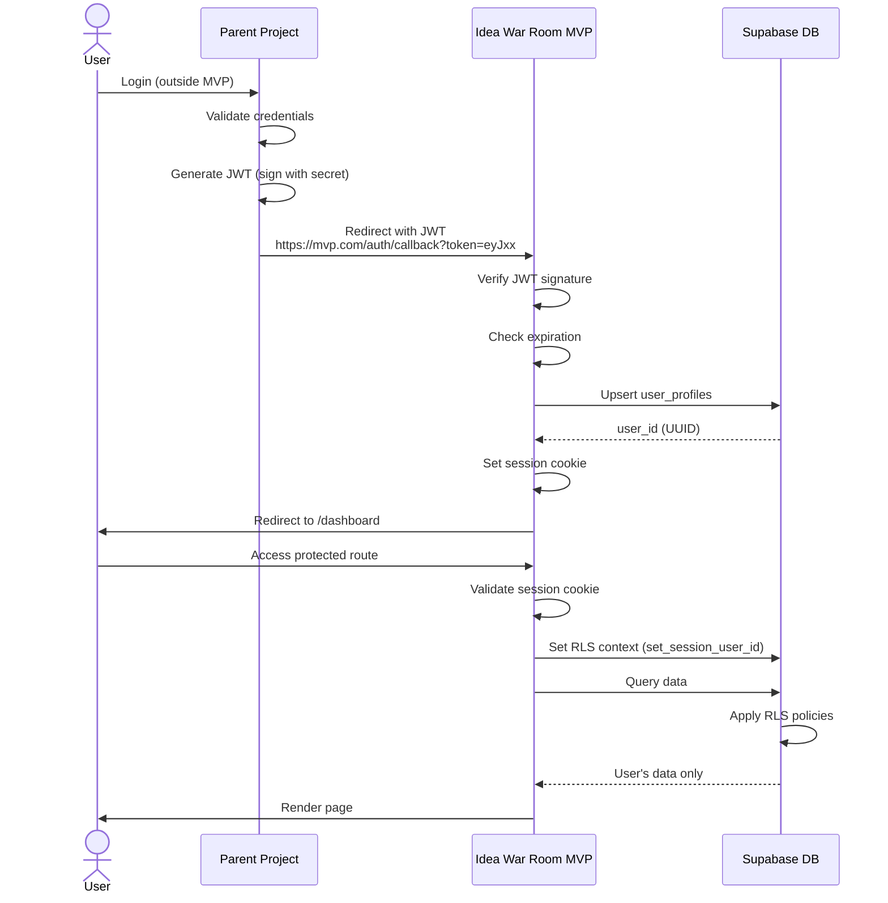
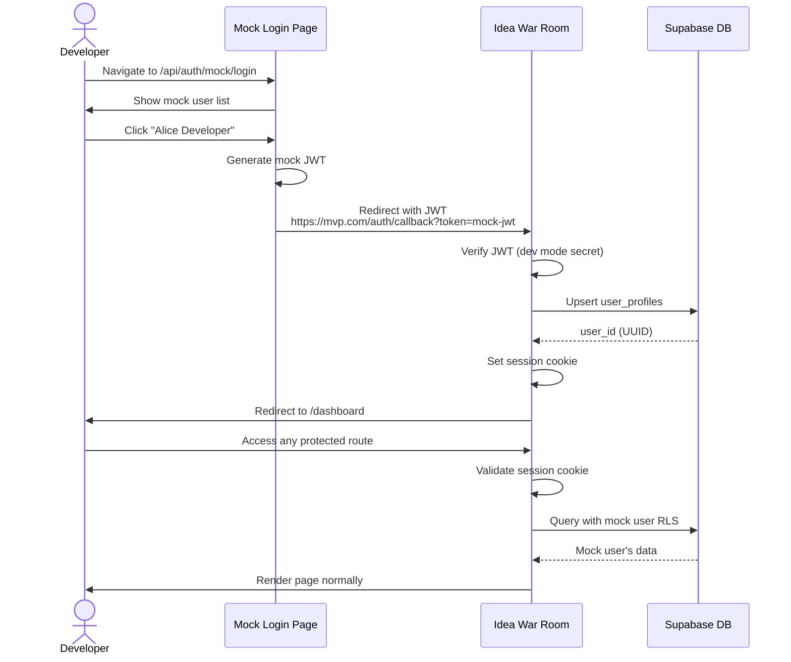

# F-01: External Authentication Integration

**Version**: 2.0
**Last Updated**: 2025-12-09
**Priority**: CRITICAL
**Status**: ✅ Spec Complete

---

## Quick Reference

**What**: JWT-based authentication integration with parent project. Users authenticate via parent project; MVP receives JWT token with user information.

**Why**: MVP is embedded in parent project that handles user authentication. No need for separate login system.

**Dependencies**:
- S-03: Database Schema (custom RLS functions, user_profiles table)
- Parent Project: Must generate signed JWT tokens with user information

**Used By**:
- F-02: Idea Intake Form (requires authenticated user)
- F-03: Research Engine (requires authenticated user)
- F-04: MVTA Red Team Simulation (requires authenticated user)
- F-06: Interactive Q&A Session (requires authenticated user)
- F-08: Feedback Collection (requires authenticated user)
- F-09: Session History (requires authenticated user)

**Implementation Status**:
- [ ] PRD documented
- [ ] Technical design complete
- [ ] Tests defined
- [ ] Implementation started
- [ ] Implementation complete
- [ ] Tests passing
- [ ] Deployed to production

---

## Dependencies

### Required System Modules
- [S-03: Database Schema](../system/S-03-database-schema.md) - Custom RLS functions (`get_current_user_id()`, `set_session_user_id()`)

### External Services
- **Parent Project** - Provides user authentication
  - Generates signed JWT tokens with user info (sub, email, name, metadata)
  - Redirects to MVP with JWT token
  - Provides login page URL for unauthorized redirects
- **Supabase** - Database only (not auth)
  - PostgreSQL 15
  - Row-Level Security (RLS) via custom functions
  - Auto-generated REST API

### External Libraries
- `jsonwebtoken` (^9.0.2) - JWT verification
- `@types/jsonwebtoken` (^9.0.5) - TypeScript types

---

## PRD: Product Requirements

### Overview

This feature implements JWT-based authentication delegation from a parent project. Users authenticate with the parent project, which generates a signed JWT containing user information and redirects to the MVP. The MVP validates the JWT, creates/updates user profiles, and manages sessions via HTTP-only cookies.

**Key Capabilities**:
1. JWT token validation from parent project
2. User profile creation/update based on JWT payload
3. Session management via HTTP-only cookies
4. Row-Level Security enforcement with custom session functions
5. Redirect to parent login page on unauthorized access

**Authentication Flow**:
```
User → Parent Auth → JWT generated → MVP validates → Session created → Protected routes accessible
```

**No MVP-managed features**:
- ❌ No signup/login forms
- ❌ No password management
- ❌ No email verification
- ❌ No password reset
- ✅ All authentication handled by parent project

---

### User Flow

**Scenario 1: First-Time User (JWT Authentication)**

**Step 1**: User authenticates with parent project
- User: Logs in to parent project (outside MVP scope)
- Parent: Validates credentials, generates JWT with user info
- JWT payload:
  ```json
  {
    "sub": "parent-user-123",
    "email": "founder@startup.com",
    "name": "Jane Founder",
    "iat": 1702345678,
    "exp": 1702349278,
    "metadata": {"company": "Acme Inc"}
  }
  ```

**Step 2**: Parent redirects to MVP with JWT
- Parent: Redirects to `https://mvp.com/auth/callback?token=eyJxxx...`
- MVP: Receives request with JWT token in query parameter

**Step 3**: MVP validates JWT
- MVP: Extracts token from query parameter
- MVP: Verifies signature using shared secret
- MVP: Validates expiration (iat, exp)
- MVP: Validates required fields (sub, email)

**Step 4**: MVP creates user profile
- MVP: Checks if user exists (by `external_user_id = JWT.sub`)
- MVP: If new user, creates `user_profiles` record
- MVP: If existing user, updates email/name/metadata if changed

**Step 5**: MVP sets session cookie
- MVP: Sets HTTP-only cookie with JWT
- Cookie: `auth_token=eyJxxx...; HttpOnly; Secure; SameSite=Lax; Max-Age=604800`
- MVP: Redirects to `/dashboard`

**Step 6**: User accesses MVP
- User: Sees dashboard with their past sessions
- System: User is authenticated, can create new MVTA analyses

---

**Scenario 2: Returning User (Session Cookie)**

**Step 1**: User navigates to MVP
- User: Clicks link from parent project or bookmark: `https://mvp.com/dashboard`
- MVP: Checks for `auth_token` cookie

**Step 2**: MVP validates session
- MVP: Extracts JWT from cookie
- MVP: Verifies signature and expiration
- MVP: Confirms JWT not expired

**Step 3**: Access granted
- MVP: User accesses protected route
- System: All API calls include authenticated user context

---

**Scenario 3: Expired Session (Redirect to Parent)**

**Step 1**: JWT expires
- User: Tries to access MVP after token expiration (e.g., 1 hour later)
- MVP: Detects expired JWT

**Step 2**: Redirect to parent login
- MVP: Redirects to `https://parent.com/login?redirect=https://mvp.com/dashboard`
- User: Re-authenticates with parent project

**Step 3**: Re-authentication
- Parent: Generates new JWT after successful login
- Parent: Redirects back to MVP with new token
- MVP: Validates new JWT, sets new session cookie

---

**Scenario 4: Unauthorized Access (No Token)**

**Step 1**: User tries direct access without authentication
- User: Navigates directly to `https://mvp.com/dashboard` (no session cookie)
- MVP: No `auth_token` cookie found

**Step 2**: Redirect to parent login
- MVP: Redirects to `https://parent.com/login?redirect=https://mvp.com/dashboard`
- User: Must authenticate with parent project first

---

### UI Components

**No Auth UI Components in MVP** - All authentication UI is handled by parent project.

**MVP Only Displays**:
- User email/name in navigation (from session)
- "Logout" button (clears session, redirects to parent)
- Loading spinner during JWT validation
- Error messages for invalid tokens

**Navigation Bar**:
```
┌─────────────────────────────────────────┐
│ Logo    Dashboard  History    jane@... ▼│
└─────────────────────────────────────────┘
                                     ↓
                                 [Dropdown]
                                 Logout
```

---

### Business Rules

1. **JWT Expiration**: Tokens expire after 1 hour (configurable by parent project)
2. **Session Cookie Lifetime**: 7 days (but JWT expiration takes precedence)
3. **User Profile Upsert**: Always update email/name/metadata on each JWT validation (keep profile fresh)
4. **Redirect Preservation**: After re-authentication, user returns to original destination URL
5. **No Email Verification**: Assumed handled by parent project
6. **No Rate Limiting**: MVP trusts parent project to prevent abuse

---

### Acceptance Criteria

- [ ] User with valid JWT from parent can access MVP
- [ ] User profile created in `user_profiles` table with `external_user_id` from JWT `sub`
- [ ] Session cookie set with HTTP-only, Secure, SameSite=Lax flags
- [ ] Expired JWT redirects to parent login page with `redirect` parameter
- [ ] Unauthorized access (no token) redirects to parent login page
- [ ] RLS policies enforce data isolation using `get_current_user_id()` function
- [ ] User can logout (clears cookie, redirects to parent)
- [ ] User's email/name displayed in navigation bar
- [ ] All protected routes require valid JWT
- [ ] API endpoints validate JWT and set user context for database queries

---

## Technical Implementation

### Authentication Flow Diagram



---

### API Endpoints

#### Endpoint 1: GET /api/auth/callback

**Purpose**: Handle authentication callback from parent project with JWT token

**Query Parameters**:
- `token` (required): JWT from parent project

**Request Example**:
```
GET /api/auth/callback?token=eyJhbGciOiJIUzI1NiIsInR5cCI6IkpXVCJ9...
```

**Response** (Success - 302 Redirect):
```
Location: /dashboard
Set-Cookie: auth_token=eyJxx...; HttpOnly; Secure; SameSite=Lax; Max-Age=604800; Path=/
```

**Response** (Error - 401):
```typescript
{
  "error": "Authentication failed",
  "details": "JWT expired"
}
```

**Error Codes**:
- `JWT_EXPIRED`: Token expiration time exceeded
- `INVALID_SIGNATURE`: JWT signature verification failed
- `MISSING_REQUIRED_FIELDS`: JWT missing `sub` or `email` claims
- `DATABASE_ERROR`: Failed to create/update user profile

**Implementation**:
```typescript
// app/api/auth/callback/route.ts
import { NextRequest, NextResponse } from 'next/server';
import { verifyJWT } from '@/lib/auth/jwt';
import { upsertUserProfile } from '@/lib/auth/user';
import { setSessionCookie } from '@/lib/auth/session';

export async function GET(request: NextRequest) {
  try {
    const url = new URL(request.url);
    const token = url.searchParams.get('token');

    if (!token) {
      return NextResponse.json(
        { error: 'Missing token parameter' },
        { status: 400 }
      );
    }

    // Verify JWT
    const payload = verifyJWT(token);

    // Upsert user profile
    const userId = await upsertUserProfile(payload);

    // Set session cookie
    const response = NextResponse.redirect(new URL('/dashboard', request.url));
    setSessionCookie(response, token);

    return response;

  } catch (error) {
    console.error('Auth callback failed:', error);

    return NextResponse.json(
      { error: 'Authentication failed', details: (error as Error).message },
      { status: 401 }
    );
  }
}
```

---

#### Endpoint 2: GET /api/auth/session

**Purpose**: Get current authenticated user session

**Response** (Success - 200):
```typescript
{
  "user": {
    "id": "uuid-internal",
    "external_user_id": "parent-user-123",
    "email": "founder@startup.com",
    "name": "Jane Founder",
    "metadata": {
      "company": "Acme Inc"
    }
  }
}
```

**Response** (Unauthorized - 401):
```typescript
{
  "user": null
}
```

**Implementation**:
```typescript
// app/api/auth/session/route.ts
import { NextResponse } from 'next/server';
import { getCurrentUser } from '@/lib/auth/middleware';

export async function GET() {
  try {
    const user = await getCurrentUser();

    return NextResponse.json({ user });
  } catch (error) {
    return NextResponse.json({ user: null }, { status: 401 });
  }
}
```

---

#### Endpoint 3: POST /api/auth/logout

**Purpose**: Clear session cookie and redirect to parent login

**Response** (Success - 200):
```typescript
{
  "message": "Logged out"
}
```

**Side Effects**:
- Clears `auth_token` cookie
- Session invalidated immediately

**Implementation**:
```typescript
// app/api/auth/logout/route.ts
import { NextResponse } from 'next/server';
import { clearSessionCookie } from '@/lib/auth/session';

export async function POST() {
  const response = NextResponse.json({ message: 'Logged out' });
  clearSessionCookie(response);

  return response;
}
```

---

### Backend Components

#### Component 1: JWT Validation

**File**: `src/lib/auth/jwt.ts`

**Purpose**: Verify JWT tokens from parent project

**Key Functions**:

```typescript
import jwt from 'jsonwebtoken';

export interface JWTPayload {
  sub: string;           // External user ID (required)
  email: string;         // User email (required)
  name?: string;         // Display name (optional)
  iat: number;           // Issued at timestamp
  exp: number;           // Expiration timestamp
  metadata?: Record<string, any>; // Additional data
}

const JWT_SECRET = process.env.JWT_SECRET!;
const JWT_ALGORITHM = 'HS256';

/**
 * Verify JWT token from parent project
 * Throws error if invalid, expired, or missing required fields
 */
export function verifyJWT(token: string): JWTPayload {
  try {
    const payload = jwt.verify(token, JWT_SECRET, {
      algorithms: [JWT_ALGORITHM]
    }) as JWTPayload;

    // Validate required fields
    if (!payload.sub || !payload.email) {
      throw new Error('Invalid JWT: missing required fields (sub, email)');
    }

    return payload;
  } catch (error) {
    if (error instanceof jwt.TokenExpiredError) {
      throw new Error('JWT expired');
    }
    if (error instanceof jwt.JsonWebTokenError) {
      throw new Error('Invalid JWT signature');
    }
    throw error;
  }
}

/**
 * Extract JWT from request (query param or cookie)
 */
export function extractJWT(request: Request): string | null {
  // Try query parameter (for initial redirect from parent)
  const url = new URL(request.url);
  const tokenFromQuery = url.searchParams.get('token');
  if (tokenFromQuery) return tokenFromQuery;

  // Try cookie (for subsequent requests)
  const cookieHeader = request.headers.get('cookie');
  if (!cookieHeader) return null;

  const cookies = Object.fromEntries(
    cookieHeader.split('; ').map(c => c.split('='))
  );

  return cookies['auth_token'] || null;
}
```

---

#### Component 2: Session Management

**File**: `src/lib/auth/session.ts`

**Purpose**: Manage session cookies

```typescript
export interface UserSession {
  userId: string;         // Internal UUID
  externalUserId: string; // Parent project user ID
  email: string;
  name: string | null;
  metadata: Record<string, any>;
}

const SESSION_COOKIE_NAME = 'auth_token';
const SESSION_MAX_AGE = 60 * 60 * 24 * 7; // 7 days

/**
 * Set session cookie with JWT
 */
export function setSessionCookie(response: NextResponse, token: string) {
  response.cookies.set(SESSION_COOKIE_NAME, token, {
    httpOnly: true,
    secure: process.env.NODE_ENV === 'production',
    sameSite: 'lax',
    maxAge: SESSION_MAX_AGE,
    path: '/'
  });
}

/**
 * Clear session cookie
 */
export function clearSessionCookie(response: NextResponse) {
  response.cookies.delete(SESSION_COOKIE_NAME);
}

/**
 * Get session token from cookies (server-side)
 */
export function getSessionToken(): string | null {
  const { cookies } = require('next/headers');
  return cookies().get(SESSION_COOKIE_NAME)?.value || null;
}
```

---

#### Component 3: User Management

**File**: `src/lib/auth/user.ts`

**Purpose**: Create/update user profiles from JWT payload

```typescript
import { createClient } from '@supabase/supabase-js';
import { JWTPayload } from './jwt';

const supabase = createClient(
  process.env.NEXT_PUBLIC_SUPABASE_URL!,
  process.env.SUPABASE_SERVICE_ROLE_KEY! // Service role for admin operations
);

/**
 * Upsert user profile from JWT payload
 * Creates new user if doesn't exist, updates if exists
 * Returns internal user UUID
 */
export async function upsertUserProfile(payload: JWTPayload): Promise<string> {
  const { data, error } = await supabase
    .from('user_profiles')
    .upsert({
      external_user_id: payload.sub,
      email: payload.email,
      full_name: payload.name || null,
      metadata: payload.metadata || {},
      updated_at: new Date().toISOString()
    }, {
      onConflict: 'external_user_id',
      ignoreDuplicates: false // Always update on conflict
    })
    .select('id')
    .single();

  if (error) {
    throw new Error(`Failed to upsert user profile: ${error.message}`);
  }

  return data.id;
}

/**
 * Get user profile by external user ID
 */
export async function getUserProfileByExternalId(
  externalUserId: string
): Promise<any> {
  const { data, error } = await supabase
    .from('user_profiles')
    .select('*')
    .eq('external_user_id', externalUserId)
    .single();

  if (error) {
    throw new Error(`User not found: ${error.message}`);
  }

  return data;
}
```

---

#### Component 4: Authentication Middleware

**File**: `src/lib/auth/middleware.ts`

**Purpose**: Replace `supabase.auth.getUser()` with custom JWT validation

```typescript
import { createClient } from '@supabase/supabase-js';
import { getSessionToken } from './session';
import { verifyJWT } from './jwt';
import { getUserProfileByExternalId } from './user';

/**
 * Get current authenticated user from session
 * Throws error if not authenticated
 */
export async function getCurrentUser() {
  const token = getSessionToken();

  if (!token) {
    throw new Error('No session token');
  }

  const payload = verifyJWT(token);
  const userProfile = await getUserProfileByExternalId(payload.sub);

  return {
    id: userProfile.id,
    externalUserId: userProfile.external_user_id,
    email: userProfile.email,
    name: userProfile.full_name,
    metadata: userProfile.metadata
  };
}

/**
 * Create Supabase client with RLS context
 * Sets session variable for RLS policies
 * Use this instead of supabase.auth.getUser()
 */
export async function createAuthenticatedSupabaseClient() {
  const user = await getCurrentUser();

  const supabase = createClient(
    process.env.NEXT_PUBLIC_SUPABASE_URL!,
    process.env.SUPABASE_SERVICE_ROLE_KEY!
  );

  // Set session variable for RLS policies
  await supabase.rpc('set_session_user_id', { user_id: user.id });

  return { supabase, user };
}
```

---

#### Component 5: Next.js Middleware

**File**: `src/middleware.ts`

**Purpose**: Validate JWT on all requests

```typescript
import { NextResponse } from 'next/server';
import type { NextRequest } from 'next/server';
import { verifyJWT, extractJWT } from '@/lib/auth/jwt';
import { setSessionCookie } from '@/lib/auth/session';

const PUBLIC_ROUTES = ['/auth/callback', '/_next', '/api/health'];
const PARENT_LOGIN_URL = process.env.PARENT_LOGIN_URL || 'https://parent.com/login';

export function middleware(request: NextRequest) {
  const { pathname } = request.nextUrl;

  // Allow public routes
  if (PUBLIC_ROUTES.some(route => pathname.startsWith(route))) {
    return NextResponse.next();
  }

  try {
    // Extract and verify JWT
    const token = extractJWT(request);

    if (!token) {
      // No token - redirect to parent login
      return NextResponse.redirect(
        `${PARENT_LOGIN_URL}?redirect=${encodeURIComponent(request.url)}`
      );
    }

    // Verify JWT
    const payload = verifyJWT(token);

    // Token is valid - continue
    const response = NextResponse.next();

    // If token came from query param, set it as cookie and redirect to clean URL
    if (request.nextUrl.searchParams.has('token')) {
      const cleanUrl = new URL(request.url);
      cleanUrl.searchParams.delete('token');
      const redirectResponse = NextResponse.redirect(cleanUrl);
      setSessionCookie(redirectResponse, token);
      return redirectResponse;
    }

    return response;

  } catch (error) {
    // Invalid or expired token - redirect to parent login
    console.error('JWT validation failed:', error);
    return NextResponse.redirect(
      `${PARENT_LOGIN_URL}?redirect=${encodeURIComponent(request.url)}`
    );
  }
}

export const config = {
  matcher: ['/((?!_next/static|_next/image|favicon.ico).*)']
};
```

---

### Frontend Components

#### Component 1: AuthContext

**File**: `src/contexts/AuthContext.tsx`

**Purpose**: Provide user session to React components

```typescript
'use client';

import { createContext, useContext, useEffect, useState } from 'react';

interface User {
  id: string;
  email: string;
  name: string | null;
}

interface AuthContextType {
  user: User | null;
  isLoading: boolean;
  signOut: () => Promise<void>;
}

const AuthContext = createContext<AuthContextType | undefined>(undefined);

export function AuthProvider({ children }: { children: React.ReactNode }) {
  const [user, setUser] = useState<User | null>(null);
  const [isLoading, setIsLoading] = useState(true);

  useEffect(() => {
    // Fetch current user from session
    const fetchUser = async () => {
      try {
        const res = await fetch('/api/auth/session');
        if (res.ok) {
          const data = await res.json();
          setUser(data.user);
        }
      } catch (error) {
        console.error('Failed to fetch user:', error);
      } finally {
        setIsLoading(false);
      }
    };

    fetchUser();
  }, []);

  const signOut = async () => {
    await fetch('/api/auth/logout', { method: 'POST' });

    // Redirect to parent login
    window.location.href = process.env.NEXT_PUBLIC_PARENT_LOGIN_URL || '/';
  };

  return (
    <AuthContext.Provider value={{ user, isLoading, signOut }}>
      {children}
    </AuthContext.Provider>
  );
}

export function useAuth() {
  const context = useContext(AuthContext);
  if (!context) {
    throw new Error('useAuth must be used within AuthProvider');
  }
  return context;
}
```

---

#### Component 2: ProtectedRoute

**File**: `src/components/auth/ProtectedRoute.tsx`

**Purpose**: Client-side auth check (fallback for middleware)

```typescript
'use client';

import { useEffect } from 'react';
import { useRouter } from 'next/navigation';
import { useAuth } from '@/contexts/AuthContext';

export default function ProtectedRoute({ children }: { children: React.ReactNode }) {
  const { user, isLoading } = useAuth();
  const router = useRouter();

  useEffect(() => {
    if (!isLoading && !user) {
      // Redirect to parent login
      window.location.href =
        `${process.env.NEXT_PUBLIC_PARENT_LOGIN_URL}?redirect=${encodeURIComponent(window.location.href)}`;
    }
  }, [user, isLoading, router]);

  if (isLoading) {
    return (
      <div className="flex items-center justify-center min-h-screen">
        <div className="animate-spin rounded-full h-12 w-12 border-b-2 border-blue-600"></div>
      </div>
    );
  }

  if (!user) {
    return null; // Will redirect
  }

  return <>{children}</>;
}
```

---

### Environment Configuration

**File**: `.env.local`

```bash
# Supabase (Database only, not auth)
NEXT_PUBLIC_SUPABASE_URL=https://xxx.supabase.co
NEXT_PUBLIC_SUPABASE_ANON_KEY=eyJxxx...
SUPABASE_SERVICE_ROLE_KEY=eyJxxx...

# JWT Configuration (NEW)
JWT_SECRET=your-shared-secret-key-minimum-32-characters
JWT_ALGORITHM=HS256

# Parent Project URLs (NEW)
PARENT_LOGIN_URL=https://parent.example.com/login
NEXT_PUBLIC_PARENT_LOGIN_URL=https://parent.example.com/login

# AI Builders API (existing)
AI_BUILDERS_API_KEY=xxx
AI_BUILDERS_API_URL=https://space.ai-builders.com/backend
```

**Security Notes**:
- `JWT_SECRET`: Must be shared securely with parent project (use password manager, encrypted file transfer)
- Minimum 32 characters for strong security
- Never commit `.env.local` to version control
- Use environment variables in deployment platform (e.g., Vercel)

---

## Dev Mode Authentication

### Overview

For development and testing without parent project integration, F-01 supports **mock authentication mode**. This allows developers to test all features using hardcoded test users without requiring the parent project to be operational.

### When to Use Dev Mode

**Use Dev Mode When**:
- Parent project is not yet ready for integration
- Developing/testing features locally
- Running automated tests
- Demonstrating MVP without external dependencies

**Use Production Mode When**:
- Deploying to staging or production
- Testing parent integration
- User acceptance testing (UAT)
- Production deployment

### Configuration

**Environment Variable**: `AUTH_MODE`

```bash
# Development Mode (default for local development)
AUTH_MODE=mock

# Production Mode (required for staging/production)
AUTH_MODE=jwt
```

**Mock Users Configuration**:

```bash
# Define test users (format: id:email:name;id:email:name)
MOCK_USERS=test-user-1:alice@example.com:Alice Developer;test-user-2:bob@example.com:Bob Tester

# Default user for auto-login
DEFAULT_MOCK_USER=test-user-1
```

### Dev Mode Features

1. **Mock Login Page**: `/api/auth/mock/login`
   - Lists all configured mock users
   - Click to login without password
   - No parent project required

2. **Mock JWT Generation**:
   - Generates valid JWT with test user info
   - 24-hour expiration (longer than production for convenience)
   - Same JWT format as parent project

3. **Visual Indicators**:
   - Yellow warning banner: "⚠️ Dev Mode Active"
   - User dropdown shows dev mode status
   - Prevents confusion between dev and production

4. **Full Feature Parity**:
   - All features (F-02 to F-09) work identically in dev mode
   - RLS policies enforced with mock user IDs
   - Multi-user testing possible (switch between mock users)

### Dev Mode Flow



### Security in Dev Mode

**Important Safeguards**:

1. **Mode Detection**: Mock endpoints return 403 in production mode
2. **Different Secret**: Mock JWT uses dev-only secret (not production secret)
3. **Visual Warnings**: Yellow banner prevents confusion
4. **Environment Separation**: Production deployments must set `AUTH_MODE=jwt`

**Never Deploy with `AUTH_MODE=mock` to Production!**

### Testing with Multiple Users

**Scenario**: Test RLS policies with multiple users

```bash
# 1. Login as Alice
curl http://localhost:3000/api/auth/mock/login
# Click "Alice Developer"

# 2. Create a session and damage report
# (data stored with Alice's user_id)

# 3. Logout and login as Bob
# Click "Bob Tester"

# 4. Verify Bob cannot see Alice's sessions
# RLS policies should prevent cross-user access
```

### Switching Between Modes

**From Dev Mode to Production**:
1. Set `AUTH_MODE=jwt` in environment
2. Configure `JWT_SECRET` from parent project
3. Configure `PARENT_LOGIN_URL`
4. Restart application
5. Test with real parent JWT

**From Production to Dev Mode**:
1. Set `AUTH_MODE=mock` in environment
2. Configure `MOCK_USERS` (optional, has defaults)
3. Restart application
4. Access `/api/auth/mock/login` to login

### Mock User Database

Mock users are created in the same `user_profiles` table:

```sql
-- Example mock user record
INSERT INTO user_profiles (
  external_user_id,
  email,
  full_name,
  metadata
) VALUES (
  'test-user-1',
  'alice@example.com',
  'Alice Developer',
  '{"mode": "development", "generated_at": "2025-12-09T10:00:00Z"}'::jsonb
);
```

**Benefits**:
- Mock users have real UUIDs
- RLS policies work identically
- Data persists across sessions (unless manually cleared)
- Easy migration to production (just change auth mode)

### Troubleshooting Dev Mode

**Issue**: Mock login page shows 403 error
- **Solution**: Verify `AUTH_MODE=mock` in environment

**Issue**: Session expires immediately
- **Solution**: Check that JWT secret matches in `jwt.ts` and `mock.ts`

**Issue**: Cannot see other mock users' data
- **Solution**: This is correct! RLS policies are enforced. Each user sees only their data.

**Issue**: Dev mode banner not showing
- **Solution**: Verify `DevModeBanner` component added to layout

---

## Tests

### Tier 1 Critical Path Test

**Test Name**: `JWT Authentication - Complete Flow`

**Description**: Verifies end-to-end JWT authentication from parent redirect to session creation

**Preconditions**:
- Parent project provides valid JWT
- Shared secret configured correctly

**Steps**:
1. Generate valid test JWT with user info
2. Navigate to `/auth/callback?token=eyJxx`
3. Verify user profile created/updated in database
4. Verify session cookie set with correct flags
5. Verify redirect to `/dashboard`
6. Make authenticated API call
7. Verify RLS policies enforce data isolation

**Expected Results**:
- JWT validated successfully
- User profile created with `external_user_id` from JWT `sub`
- Session cookie set with `HttpOnly; Secure; SameSite=Lax; Max-Age=604800`
- Dashboard accessible
- API calls succeed with user context
- RLS prevents cross-user data access

**Failure Impact**: ❌ **BLOCKS DEPLOYMENT** (Tier 1 test must pass)

**Implementation**:
```typescript
// tests/e2e/auth-flow.spec.ts
import { test, expect } from '@playwright/test';
import { generateTestJWT } from '@/tests/helpers/jwt';

test('JWT Authentication - Complete Flow', async ({ page, context }) => {
  // Step 1: Generate valid JWT
  const jwt = generateTestJWT({
    sub: 'test-user-123',
    email: 'test@example.com',
    name: 'Test User'
  });

  // Step 2: Navigate with JWT
  await page.goto(`/auth/callback?token=${jwt}`);

  // Step 3: Verify redirect to dashboard
  await expect(page).toHaveURL('/dashboard');

  // Step 4: Verify user authenticated
  await expect(page.locator('text=test@example.com')).toBeVisible();

  // Step 5: Verify session cookie set
  const cookies = await context.cookies();
  const authCookie = cookies.find(c => c.name === 'auth_token');
  expect(authCookie).toBeDefined();
  expect(authCookie?.httpOnly).toBe(true);
  expect(authCookie?.secure).toBe(true);
  expect(authCookie?.sameSite).toBe('Lax');

  // Step 6: Make API call
  const response = await page.request.get('/api/sessions');
  expect(response.ok()).toBe(true);
});
```

---

### E2E Tests

**Test 1: Expired JWT redirects to parent login**

```typescript
test('Expired JWT redirects to parent login', async ({ page }) => {
  const expiredJWT = generateTestJWT({
    sub: 'user-123',
    email: 'test@example.com'
  }, { expiresIn: '-1h' }); // Already expired

  await page.goto(`/auth/callback?token=${expiredJWT}`);

  // Should redirect to parent login
  await expect(page).toHaveURL(/parent\.com\/login/);
  await expect(page.url()).toContain('redirect=');
});
```

**Test 2: Unauthorized access redirects to parent login**

```typescript
test('Unauthorized access redirects to parent login', async ({ page, context }) => {
  // Clear all cookies
  await context.clearCookies();

  // Try to access protected route
  await page.goto('/dashboard');

  // Should redirect to parent login
  await expect(page).toHaveURL(/parent\.com\/login/);
});
```

**Test 3: User logout clears session**

```typescript
test('User logout clears session', async ({ page, context }) => {
  // Setup: Login first
  const jwt = generateTestJWT({
    sub: 'user-123',
    email: 'test@example.com'
  });
  await page.goto(`/auth/callback?token=${jwt}`);
  await expect(page).toHaveURL('/dashboard');

  // Click logout
  await page.click('button:has-text("Logout")');

  // Verify cookie cleared
  const cookies = await context.cookies();
  const authCookie = cookies.find(c => c.name === 'auth_token');
  expect(authCookie).toBeUndefined();

  // Try to access protected route
  await page.goto('/dashboard');
  await expect(page).toHaveURL(/parent\.com\/login/);
});
```

---

### Integration Tests

**Test 1: JWT Validation**

```typescript
// tests/lib/auth/jwt.test.ts
import { describe, it, expect } from 'vitest';
import { verifyJWT } from '@/lib/auth/jwt';
import jwt from 'jsonwebtoken';

describe('JWT Verification', () => {
  const SECRET = process.env.JWT_SECRET || 'test-secret-key-min-32-characters';

  it('verifies valid JWT', () => {
    const token = jwt.sign(
      { sub: 'user-123', email: 'test@example.com' },
      SECRET,
      { expiresIn: '1h' }
    );

    const payload = verifyJWT(token);

    expect(payload.sub).toBe('user-123');
    expect(payload.email).toBe('test@example.com');
  });

  it('rejects expired JWT', () => {
    const token = jwt.sign(
      { sub: 'user-123', email: 'test@example.com' },
      SECRET,
      { expiresIn: '-1h' }
    );

    expect(() => verifyJWT(token)).toThrow('JWT expired');
  });

  it('rejects JWT with invalid signature', () => {
    const token = jwt.sign(
      { sub: 'user-123', email: 'test@example.com' },
      'wrong-secret',
      { expiresIn: '1h' }
    );

    expect(() => verifyJWT(token)).toThrow('Invalid JWT');
  });

  it('rejects JWT missing required fields', () => {
    const token = jwt.sign(
      { sub: 'user-123' }, // Missing email
      SECRET,
      { expiresIn: '1h' }
    );

    expect(() => verifyJWT(token)).toThrow('missing required fields');
  });
});
```

**Test 2: User Profile Upsert**

```typescript
// tests/lib/auth/user.test.ts
import { describe, it, expect, beforeEach } from 'vitest';
import { upsertUserProfile } from '@/lib/auth/user';
import { supabase } from '@/lib/supabase';

describe('User Profile Upsert', () => {
  beforeEach(async () => {
    // Clean test data
    await supabase.from('user_profiles').delete().like('external_user_id', 'test-%');
  });

  it('creates new user profile', async () => {
    const payload = {
      sub: 'test-user-new',
      email: 'new@example.com',
      name: 'New User',
      iat: Date.now() / 1000,
      exp: Date.now() / 1000 + 3600,
      metadata: { company: 'Acme' }
    };

    const userId = await upsertUserProfile(payload);

    expect(userId).toBeDefined();

    // Verify in database
    const { data } = await supabase
      .from('user_profiles')
      .select('*')
      .eq('external_user_id', 'test-user-new')
      .single();

    expect(data.email).toBe('new@example.com');
    expect(data.full_name).toBe('New User');
    expect(data.metadata.company).toBe('Acme');
  });

  it('updates existing user profile', async () => {
    // Create initial profile
    const initialPayload = {
      sub: 'test-user-existing',
      email: 'old@example.com',
      name: 'Old Name',
      iat: Date.now() / 1000,
      exp: Date.now() / 1000 + 3600
    };
    await upsertUserProfile(initialPayload);

    // Update with new data
    const updatePayload = {
      sub: 'test-user-existing',
      email: 'new@example.com',
      name: 'New Name',
      iat: Date.now() / 1000,
      exp: Date.now() / 1000 + 3600
    };
    await upsertUserProfile(updatePayload);

    // Verify updated
    const { data } = await supabase
      .from('user_profiles')
      .select('*')
      .eq('external_user_id', 'test-user-existing')
      .single();

    expect(data.email).toBe('new@example.com');
    expect(data.full_name).toBe('New Name');
  });
});
```

**Test 3: RLS Policy Enforcement**

```typescript
// tests/integration/rls-policies.test.ts
import { describe, it, expect } from 'vitest';
import { createTestUserWithJWT, createTestSessionForUser } from '@/tests/helpers';

describe('RLS Policy Enforcement', () => {
  it('prevents user A from accessing user B data', async () => {
    // Create two users
    const userA = await createTestUserWithJWT('user-a@example.com');
    const userB = await createTestUserWithJWT('user-b@example.com');

    // User A creates a session
    const sessionA = await createTestSessionForUser(userA.id);

    // User B tries to query User A's session
    const tokenB = generateTestJWT({
      sub: userB.externalUserId,
      email: userB.email
    });

    const response = await fetch('/api/sessions', {
      headers: { Cookie: `auth_token=${tokenB}` }
    });

    const data = await response.json();

    // Should only see their own sessions (not User A's)
    expect(data.sessions).toHaveLength(0);
    expect(data.sessions).not.toContainEqual(
      expect.objectContaining({ id: sessionA.id })
    );
  });
});
```

---

### Unit Tests

**Test 1: extractJWT from query param**

```typescript
it('extracts JWT from query parameter', () => {
  const request = new Request('https://mvp.com/auth/callback?token=eyJxx');
  const token = extractJWT(request);

  expect(token).toBe('eyJxx');
});
```

**Test 2: extractJWT from cookie**

```typescript
it('extracts JWT from cookie', () => {
  const request = new Request('https://mvp.com/dashboard', {
    headers: { Cookie: 'auth_token=eyJxx; other=value' }
  });
  const token = extractJWT(request);

  expect(token).toBe('eyJxx');
});
```

---

### Test Helpers

**File**: `tests/helpers/jwt.ts`

```typescript
import jwt from 'jsonwebtoken';

export function generateTestJWT(
  payload: {
    sub: string;
    email: string;
    name?: string;
    metadata?: Record<string, any>;
  },
  options?: { expiresIn?: string }
) {
  return jwt.sign(
    {
      ...payload,
      iat: Math.floor(Date.now() / 1000),
      exp: Math.floor(Date.now() / 1000) + (options?.expiresIn ? parseExpiry(options.expiresIn) : 3600)
    },
    process.env.JWT_SECRET || 'test-secret-key-min-32-characters',
    { algorithm: 'HS256' }
  );
}

function parseExpiry(expiry: string): number {
  if (expiry.endsWith('h')) {
    return parseInt(expiry) * 3600;
  }
  if (expiry.endsWith('m')) {
    return parseInt(expiry) * 60;
  }
  return parseInt(expiry);
}
```

---

## Notes

### Advantages of JWT Delegation

1. **Cross-Domain**: Works seamlessly across different domains/servers
2. **Stateless**: MVP doesn't need to call parent API for every request
3. **Simple Integration**: Minimal integration surface (just JWT exchange)
4. **Secure**: Signed tokens with short expiration
5. **Temporary-Friendly**: Easy to replace with OAuth or SSO later

### Security Considerations

1. **JWT Secret**: Must be securely shared between parent and MVP (min 32 chars)
2. **Token Expiration**: 1-hour expiration recommended (configurable)
3. **HTTPS Required**: Prevent token interception in transit
4. **HTTP-Only Cookies**: Prevent XSS attacks (JavaScript cannot access)
5. **Redirect Validation**: Validate redirect URLs to prevent open redirects

### Parent Project Requirements

**Parent project must provide**:
1. JWT generation with user info (sub, email, name, metadata)
2. Shared secret key for JWT signing (HS256 algorithm)
3. Redirect to MVP: `https://mvp.com/auth/callback?token=eyJxx`
4. Login page URL for unauthorized redirects

**JWT Payload Format**:
```json
{
  "sub": "parent-user-id",
  "email": "user@example.com",
  "name": "User Name",
  "iat": 1702345678,
  "exp": 1702349278,
  "metadata": {
    "company": "Acme Inc",
    "role": "founder"
  }
}
```

### Known Limitations

- No password reset (delegated to parent)
- No user profile editing (delegated to parent)
- Session expires after 1 hour (requires re-authentication)
- No refresh token mechanism (future enhancement)
- No multi-tenancy support (single parent project only)

### Future Enhancements

- **Refresh Tokens**: Implement token refresh without parent redirect
- **OAuth 2.0**: Migrate to OAuth for more robust integration
- **SSO**: Support multiple parent projects
- **Admin API**: Allow parent to revoke user access
- **Audit Logging**: Track authentication events
