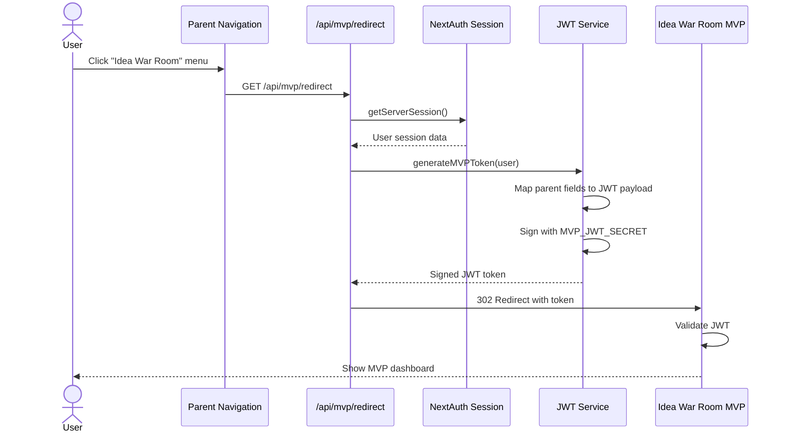

# Parent Project: JWT Integration for Idea War Room MVP

**Version**: 1.0
**Last Updated**: 2025-12-09
**Priority**: HIGH
**Status**: ✅ Spec Complete

---

## Quick Reference

**What**: Add JWT-based single sign-on (SSO) integration to allow authenticated users to access Idea War Room MVP with a single click.

**Why**: Enable seamless user experience - users already logged into parent project can access MVP without re-authenticating.

**Dependencies**:
- Existing user authentication system in parent project (NextAuth)
- JWT library (e.g., jsonwebtoken for Node.js, PyJWT for Python)
- Shared secret key with MVP

**Integration Point**:
- Menu item in parent project navigation
- Redirect endpoint: `https://idea-war-room.com/auth/callback?token={jwt}`

**Parent Authentication Stack**:
- NextAuth (next-auth) for session management
- User session accessible via `getServerSession()`

---

## Dependencies

### Required System Modules
- Parent project's existing authentication system (NextAuth)
- User session/profile management
- Navigation component

### External Libraries
- `jsonwebtoken` (^9.0.2) - JWT generation and signing
- `next-auth` (existing) - Session management

### Integration with MVP
- [F-01: External Authentication Integration](../features/F-01-database-auth.md) - MVP's authentication spec
- Shared secret key (`MVP_JWT_SECRET`)
- MVP callback URL: `https://idea-war-room.com/auth/callback`

---

## PRD: Product Requirements

### Overview

This feature adds a menu item to the parent project that allows authenticated users to seamlessly access the Idea War Room MVP. When clicked, the system generates a signed JWT token containing user information and redirects to the MVP.

**Key Capabilities**:
1. Menu item visible to all authenticated users
2. JWT generation with user profile data
3. Secure redirect to MVP with token
4. Token expiration (1 hour recommended)
5. Error handling for failed token generation

**Authentication Flow**:
```
User (already logged in) → Click "Idea War Room" menu → Generate JWT → Redirect to MVP
```

**No Additional Login Required**: Users are already authenticated in parent project.

---

### User Flow

**Scenario 1: Successful Access to MVP**

**Precondition**: User is logged into parent project via NextAuth

**Step 1**: User navigates parent project
- User: Browses parent project website (already logged in)
- System: NextAuth session is active and valid

**Step 2**: User sees Idea War Room menu
- User: Sees menu item labeled "Idea War Room" or "MVTA Analysis" in navigation
- UI: Menu item is visible and clickable

**Step 3**: User clicks menu
- User: Clicks "Idea War Room" menu item
- System: Browser navigates to `/api/mvp/redirect`

**Step 4**: Parent generates JWT
- System: Retrieves current user's profile from NextAuth session
- System: Extracts user data:
  - `uuid`: "550e8400-e29b-41d4-a716-446655440000"
  - `email`: "john@example.com"
  - `name`: "John Doe"
  - `avatar_url`, `nickname`, `created_at`, etc.
- System: Generates signed JWT with:
  ```json
  {
    "sub": "550e8400-e29b-41d4-a716-446655440000",
    "email": "john@example.com",
    "name": "John Doe",
    "iat": 1702345678,
    "exp": 1702349278,
    "metadata": {
      "nickname": "John Doe",
      "avatar_url": "https://lh3.googleusercontent.com/a/...",
      "image": "https://lh3.googleusercontent.com/a/...",
      "created_at": "2024-12-01T08:30:00.000Z"
    }
  }
  ```
- System: Signs JWT with shared secret key (HS256 algorithm)

**Step 5**: Parent redirects to MVP
- System: Redirects to `https://idea-war-room.com/auth/callback?token=eyJxx...`
- Browser: Navigates to MVP

**Step 6**: MVP validates and logs in user
- MVP: Validates JWT signature and expiration
- MVP: Creates/updates user profile in MVP database
- MVP: Sets session cookie
- MVP: Redirects user to MVP dashboard
- User: Sees MVP interface, ready to use MVTA features

---

**Scenario 2: User Not Logged In**

**Step 1**: User not authenticated in parent
- User: Tries to access parent project without login
- System: NextAuth redirects to login page

**Step 2**: User logs in to parent
- User: Completes login in parent project (via NextAuth)
- System: NextAuth session established

**Step 3**: User clicks Idea War Room menu
- (Follows Scenario 1 from Step 3)

---

**Scenario 3: JWT Generation Fails**

**Step 1**: User clicks Idea War Room menu
- User: Clicks menu item
- System: Attempts to generate JWT

**Step 2**: Error occurs
- System: JWT generation fails (e.g., `MVP_JWT_SECRET` not configured, missing user data)
- System: Logs error details to console/logs

**Step 3**: Show error message
- API: Returns 500 error with error message
- UI: Displays error message: "Unable to access Idea War Room. Please try again later."
- UI: Optionally provides "Retry" button
- User: Sees error, cannot access MVP

---

### Field Mapping: Parent Session → JWT Payload

Parent project uses NextAuth with the following session structure:

```json
{
  "user": {
    "uuid": "550e8400-e29b-41d4-a716-446655440000",
    "nickname": "John Doe",
    "email": "john@example.com",
    "avatar_url": "https://lh3.googleusercontent.com/a/...",
    "created_at": "2024-12-01T08:30:00.000Z",
    "name": "John Doe",
    "image": "https://lh3.googleusercontent.com/a/..."
  }
}
```

**Field Mapping Table**:

| Parent Field | JWT Field | Required | Notes |
|-------------|-----------|----------|-------|
| `uuid` | `sub` | ✅ Yes | User's unique identifier |
| `email` | `email` | ✅ Yes | User's email address |
| `name` | `name` | ✅ Yes | User's display name |
| `nickname` | `metadata.nickname` | ⬜ No | Alternative display name |
| `avatar_url` | `metadata.avatar_url` | ⬜ No | User's profile picture URL |
| `image` | `metadata.image` | ⬜ No | Alternative avatar URL |
| `created_at` | `metadata.created_at` | ⬜ No | Account creation timestamp |

**Mapping Strategy**: Use direct mapping (not modifying MVP's JWT format)
- MVP's F-01 already defines expected JWT structure
- Parent adapts to MVP's requirements (correct integration pattern)
- All parent fields fit into JWT (required + metadata)
- No data loss, clean separation of concerns

---

### UI Components

**Component 1: Navigation Menu Item**

**Location**: Parent project's main navigation bar (header/sidebar)

**Visual Design**:
```
┌─────────────────────────────────────────┐
│ Logo  Dashboard  Projects  [Idea War Room] │
└─────────────────────────────────────────┘
```

**Specifications**:
- **Label**: "Idea War Room" or "MVTA Analysis" (configurable)
- **Icon**: Optional icon (🚀, 💡, 🛡️, or custom)
- **Placement**: In main navigation, after existing menu items
- **Visibility**: Only shown to authenticated users
- **Behavior**: Opens in same tab (redirect) or new tab (optional)
- **Link**: `/api/mvp/redirect`

**States**:
- **Default**: Normal menu item appearance
- **Hover**: Highlight effect (matches parent project's style)
- **Loading**: Brief loading indicator during JWT generation (optional)
- **Disabled**: Grayed out if user doesn't have access (optional)

---

**Component 2: Error Message (if JWT generation fails)**

**Appearance**:
```
┌─────────────────────────────────────────┐
│ ⚠️  Unable to access Idea War Room      │
│                                         │
│ We encountered an error. Please try    │
│ again later or contact support.         │
│                                         │
│         [Retry]    [Close]              │
└─────────────────────────────────────────┘
```

---

### Business Rules

1. **Menu Visibility**: Menu item only visible to authenticated users
2. **Token Expiration**: JWT expires after 1 hour (configurable: 3600 seconds)
3. **User Data Mapping**:
   - `sub`: Parent's UUID (from session.user.uuid)
   - `email`: User's email (from session.user.email)
   - `name`: User's name or nickname (from session.user.name || session.user.nickname)
   - `metadata`: All other user fields (avatar_url, image, created_at, etc.)
4. **Redirect Behavior**: Opens MVP in same tab by default (can configure to open in new tab)
5. **Error Handling**: If JWT generation fails, return 500 error with user-friendly message
6. **Rate Limiting**: Optional - limit JWT generation to prevent abuse (e.g., 10 requests per minute per user)
7. **Audit Logging**: Log all MVP access attempts for security monitoring

---

### Acceptance Criteria

- [ ] Authenticated users see "Idea War Room" menu item in navigation
- [ ] Clicking menu generates JWT with correct user info (sub=uuid, email, name)
- [ ] JWT is signed with shared secret key (HS256 algorithm)
- [ ] JWT includes `iat` (issued at) and `exp` (expiration) claims
- [ ] JWT expires after 1 hour (or configured duration)
- [ ] JWT metadata includes avatar_url, nickname, created_at from parent session
- [ ] Redirect URL is correctly formatted: `https://mvp.com/auth/callback?token=eyJxx`
- [ ] User successfully lands on MVP dashboard after redirect
- [ ] MVP can validate JWT and extract user information
- [ ] Error message shown if JWT generation fails
- [ ] JWT generation logged for security auditing
- [ ] Integration works with NextAuth's `getServerSession()`

---

## Technical Implementation

### Architecture Overview



---

### Backend Components

#### Component 1: JWT Generation Service

**File**: `lib/jwt.ts` or `lib/services/jwt.ts`

**Purpose**: Generate signed JWT tokens for MVP integration

**TypeScript/Node.js Implementation**:

```typescript
// lib/jwt.ts
import jwt from 'jsonwebtoken';

// Load from environment variables
const JWT_SECRET = process.env.MVP_JWT_SECRET;
const JWT_EXPIRATION = parseInt(process.env.MVP_JWT_EXPIRATION || '3600'); // seconds

interface ParentUser {
  uuid: string;
  nickname?: string;
  email: string;
  avatar_url?: string;
  image?: string;
  name: string;
  created_at?: string;
}

interface JWTPayload {
  sub: string;
  email: string;
  name: string;
  iat: number;
  exp: number;
  metadata: {
    nickname?: string;
    avatar_url?: string;
    image?: string;
    created_at?: string;
  };
}

/**
 * Generate JWT token for Idea War Room MVP
 * Maps parent session fields to MVP's expected JWT format
 *
 * @param user - User object from NextAuth session
 * @returns Signed JWT token
 * @throws Error if MVP_JWT_SECRET not configured or user data missing
 */
export function generateMVPToken(user: ParentUser): string {
  if (!JWT_SECRET) {
    throw new Error('MVP_JWT_SECRET environment variable not configured');
  }

  if (!user.uuid || !user.email) {
    throw new Error('User missing required fields (uuid, email)');
  }

  // Map parent session fields to JWT payload
  const payload: JWTPayload = {
    sub: user.uuid,                    // Parent's UUID → JWT sub
    email: user.email,                 // Direct mapping
    name: user.name || user.nickname || user.email, // Use name, fallback to nickname or email
    iat: Math.floor(Date.now() / 1000),
    exp: Math.floor(Date.now() / 1000) + JWT_EXPIRATION,
    metadata: {
      nickname: user.nickname,
      avatar_url: user.avatar_url,
      image: user.image,
      created_at: user.created_at
    }
  };

  return jwt.sign(payload, JWT_SECRET, {
    algorithm: 'HS256'
  });
}

/**
 * Verify JWT token (for testing purposes)
 */
export function verifyMVPToken(token: string): JWTPayload {
  if (!JWT_SECRET) {
    throw new Error('MVP_JWT_SECRET not configured');
  }

  return jwt.verify(token, JWT_SECRET, {
    algorithms: ['HS256']
  }) as JWTPayload;
}
```

**JavaScript Implementation** (if not using TypeScript):

```javascript
// lib/jwt.js
const jwt = require('jsonwebtoken');

const JWT_SECRET = process.env.MVP_JWT_SECRET;
const JWT_EXPIRATION = parseInt(process.env.MVP_JWT_EXPIRATION || '3600');

/**
 * Generate JWT token for Idea War Room MVP
 * @param {Object} user - User object from NextAuth session
 * @param {string} user.uuid - User UUID
 * @param {string} user.email - User email
 * @param {string} user.name - User name
 * @returns {string} Signed JWT token
 */
function generateMVPToken(user) {
  if (!JWT_SECRET) {
    throw new Error('MVP_JWT_SECRET environment variable not configured');
  }

  if (!user.uuid || !user.email) {
    throw new Error('User missing required fields (uuid, email)');
  }

  const payload = {
    sub: user.uuid,
    email: user.email,
    name: user.name || user.nickname || user.email,
    iat: Math.floor(Date.now() / 1000),
    exp: Math.floor(Date.now() / 1000) + JWT_EXPIRATION,
    metadata: {
      nickname: user.nickname,
      avatar_url: user.avatar_url,
      image: user.image,
      created_at: user.created_at
    }
  };

  return jwt.sign(payload, JWT_SECRET, {
    algorithm: 'HS256'
  });
}

module.exports = { generateMVPToken };
```

---

#### Component 2: MVP Redirect API Endpoint

**File**: `app/api/mvp/redirect/route.ts` (Next.js 13+ App Router)

**Purpose**: Generate JWT and redirect to MVP

**Next.js App Router Implementation**:

```typescript
// app/api/mvp/redirect/route.ts
import { NextResponse } from 'next/server';
import { getServerSession } from 'next-auth';
import { authOptions } from '@/lib/auth'; // Your NextAuth config
import { generateMVPToken } from '@/lib/jwt';

const MVP_URL = process.env.MVP_URL || 'https://idea-war-room.com';

export async function GET(request: Request) {
  try {
    // Get user session from NextAuth
    const session = await getServerSession(authOptions);

    if (!session || !session.user) {
      return NextResponse.json(
        { error: 'Not authenticated' },
        { status: 401 }
      );
    }

    const user = session.user;

    // Generate JWT token for MVP
    const token = generateMVPToken(user);

    // Log for security audit
    console.log(`[MVP Access] user=${user.uuid} email=${user.email} timestamp=${new Date().toISOString()}`);

    // Redirect to MVP with token
    const redirectUrl = `${MVP_URL}/auth/callback?token=${token}`;
    return NextResponse.redirect(redirectUrl);

  } catch (error) {
    console.error('[MVP Redirect Error]', error);

    return NextResponse.json(
      {
        error: 'Failed to access Idea War Room',
        message: 'Please try again later'
      },
      { status: 500 }
    );
  }
}
```

---

**Alternative: Next.js Pages Router Implementation**:

```typescript
// pages/api/mvp/redirect.ts
import { NextApiRequest, NextApiResponse } from 'next';
import { getServerSession } from 'next-auth';
import { authOptions } from './auth/[...nextauth]';
import { generateMVPToken } from '@/lib/jwt';

const MVP_URL = process.env.MVP_URL || 'https://idea-war-room.com';

export default async function handler(
  req: NextApiRequest,
  res: NextApiResponse
) {
  if (req.method !== 'GET') {
    return res.status(405).json({ error: 'Method not allowed' });
  }

  try {
    // Get user session from NextAuth
    const session = await getServerSession(req, res, authOptions);

    if (!session || !session.user) {
      return res.status(401).json({ error: 'Not authenticated' });
    }

    const user = session.user;

    // Generate JWT token for MVP
    const token = generateMVPToken(user);

    // Log for security audit
    console.log(`[MVP Access] user=${user.uuid} email=${user.email} timestamp=${new Date().toISOString()}`);

    // Redirect to MVP with token
    const redirectUrl = `${MVP_URL}/auth/callback?token=${token}`;
    res.redirect(302, redirectUrl);

  } catch (error) {
    console.error('[MVP Redirect Error]', error);

    res.status(500).json({
      error: 'Failed to access Idea War Room',
      message: 'Please try again later'
    });
  }
}
```

---

#### Component 3: NextAuth Session Type Extension

**File**: `types/next-auth.d.ts`

**Purpose**: Extend NextAuth types to include parent's user fields

```typescript
// types/next-auth.d.ts
import 'next-auth';

declare module 'next-auth' {
  interface Session {
    user: {
      uuid: string;
      nickname?: string;
      email: string;
      avatar_url?: string;
      image?: string;
      name: string;
      created_at?: string;
    };
  }

  interface User {
    uuid: string;
    nickname?: string;
    email: string;
    avatar_url?: string;
    image?: string;
    name: string;
    created_at?: string;
  }
}
```

---

### Frontend Components

#### Component 1: Navigation Menu Item (React/Next.js)

**File**: `components/Navigation.tsx` or similar

**Purpose**: Add "Idea War Room" menu item to navigation

```tsx
// components/Navigation.tsx
'use client'; // If using Next.js App Router

import React from 'react';
import Link from 'next/link';
import { useSession } from 'next-auth/react';

export function Navigation() {
  const { data: session, status } = useSession();
  const isAuthenticated = status === 'authenticated';

  return (
    <nav className="navbar">
      <Link href="/dashboard">Dashboard</Link>
      <Link href="/projects">Projects</Link>

      {/* Idea War Room menu item */}
      {isAuthenticated && (
        <a
          href="/api/mvp/redirect"
          className="menu-item-mvp"
          title="Access Idea War Room MVP"
        >
          🚀 Idea War Room
        </a>
      )}

      {isAuthenticated && (
        <div className="user-menu">
          {session?.user?.name}
        </div>
      )}
    </nav>
  );
}
```

**Alternative: Plain HTML/JavaScript**:

```html
<!-- For non-React projects -->
<nav class="navbar">
  <a href="/dashboard">Dashboard</a>
  <a href="/projects">Projects</a>

  <!-- Idea War Room menu item (shown only when authenticated) -->
  <a href="/api/mvp/redirect" id="mvp-menu" style="display: none;" title="Access Idea War Room MVP">
    🚀 Idea War Room
  </a>

  <div class="user-menu" id="user-menu"></div>
</nav>

<script>
// Show MVP menu if user is authenticated
// Assumes window.currentUser is set by your auth system
if (window.currentUser && window.currentUser.email) {
  document.getElementById('mvp-menu').style.display = 'inline-block';
  document.getElementById('user-menu').textContent = window.currentUser.name;
}
</script>
```

---

### Environment Configuration

**File**: `.env` or `.env.local`

```bash
# ===================================
# Idea War Room MVP Integration
# ===================================

# MVP Base URL (required)
MVP_URL=https://idea-war-room.com

# Shared JWT Secret (required) - MUST match MVP's JWT_SECRET
# Minimum 32 characters recommended
MVP_JWT_SECRET=your-shared-secret-key-minimum-32-characters-replace-this

# JWT Expiration in seconds (optional, default: 3600 = 1 hour)
MVP_JWT_EXPIRATION=3600

# Optional: Menu label customization
MVP_MENU_LABEL="Idea War Room"
```

**Environment-specific Configuration**:

```bash
# Development
MVP_URL=http://localhost:3000
MVP_JWT_SECRET=dev-secret-key-min-32-chars-not-for-production

# Staging
MVP_URL=https://staging.idea-war-room.com
MVP_JWT_SECRET=staging-secret-key-min-32-chars-different-from-prod

# Production
MVP_URL=https://idea-war-room.com
MVP_JWT_SECRET=production-secret-key-min-32-chars-secure-and-rotated
```

**Security Notes**:
- `MVP_JWT_SECRET`: Must be shared securely with MVP team
- Must match the `JWT_SECRET` configured in MVP's `.env`
- Minimum 32 characters for strong security
- Never commit `.env.local` to version control
- Use different secrets for development, staging, and production
- Store production secret in secure secret management service (AWS Secrets Manager, Vercel Environment Variables, etc.)

---

## Security Considerations

### Secret Management

**1. Shared Secret (`MVP_JWT_SECRET`)**:
- Generate a strong secret (minimum 32 characters, alphanumeric + special chars)
- Share securely with MVP team via:
  - Password manager (1Password, LastPass)
  - Encrypted communication channel
  - Secret management service (AWS Secrets Manager, HashiCorp Vault)
- Never commit to version control (add `.env.local` to `.gitignore`)
- Rotate secret periodically (recommended every 6 months)
- Use different secrets for each environment (dev/staging/prod)

**2. Access Control**:
- Limit secret access to DevOps and senior engineers only
- Audit who has access to secrets
- Log all secret access/modifications

---

### Token Security

1. **Expiration**: JWT expires after 1 hour (configurable via `MVP_JWT_EXPIRATION`)
2. **Algorithm**: Use HS256 (HMAC with SHA-256) for signing
3. **HTTPS Required**: Only redirect to HTTPS MVP URLs in production
4. **Token in URL**: Token is in URL query param (acceptable for SSO redirect, short-lived)
5. **No Refresh Tokens**: User must click menu again after token expiration (simpler, more secure)
6. **Signature Verification**: MVP validates signature to prevent tampering

---

### Rate Limiting (Optional but Recommended)

Prevent abuse by limiting JWT generation requests:

```typescript
// Optional: Add rate limiting to prevent abuse
// Install: npm install express-rate-limit (if using Express)
// Or use Vercel Edge Config / Upstash Rate Limiting for Next.js

// Example with express-rate-limit
import rateLimit from 'express-rate-limit';

const mvpRateLimiter = rateLimit({
  windowMs: 60 * 1000, // 1 minute
  max: 10, // Limit each user to 10 requests per minute
  message: 'Too many requests, please try again later',
  standardHeaders: true,
  legacyHeaders: false,
});

// Apply to MVP redirect endpoint
app.get('/api/mvp/redirect', mvpRateLimiter, handler);
```

---

### Audit Logging

Log all MVP access attempts for security monitoring:

```typescript
// Log format (structured JSON for easy parsing)
console.log(JSON.stringify({
  event: 'mvp_access',
  user_uuid: user.uuid,
  user_email: user.email,
  timestamp: new Date().toISOString(),
  ip_address: req.headers['x-forwarded-for'] || req.socket.remoteAddress,
  success: true
}));
```

---

## Tests

### Tier 1 Critical Path Test

**Test Name**: `MVP JWT Integration - Complete Flow`

**Description**: Verifies end-to-end JWT generation and redirect to MVP

**Preconditions**:
- User is logged into parent project via NextAuth
- `MVP_JWT_SECRET` is configured and matches MVP's secret
- `MVP_URL` is configured correctly

**Steps**:
1. Navigate to parent project as authenticated user
2. Click "Idea War Room" menu item
3. Verify JWT is generated with correct payload structure
4. Verify JWT contains correct fields: sub (uuid), email, name, iat, exp
5. Verify JWT metadata contains avatar_url, nickname, created_at
6. Verify JWT is signed with correct secret (HS256 algorithm)
7. Verify redirect to `https://mvp.com/auth/callback?token=xxx`
8. Verify MVP can validate JWT signature
9. Verify user lands on MVP dashboard with correct profile

**Expected Results**:
- ✅ JWT generated successfully
- ✅ JWT `sub` field equals parent user's `uuid`
- ✅ JWT contains all required fields (sub, email, name, iat, exp)
- ✅ JWT metadata contains parent session fields (avatar_url, nickname, etc.)
- ✅ JWT expires after 1 hour (or configured duration)
- ✅ Redirect URL is correctly formatted
- ✅ MVP validates JWT and creates user session
- ✅ User lands on MVP dashboard
- ✅ User can access MVP features normally

**Failure Impact**: ❌ **BLOCKS INTEGRATION** (Tier 1 test must pass before deployment)

---

### E2E Tests

**Framework**: Playwright or Cypress

**Test 1: Authenticated user can access MVP via menu**

```typescript
// tests/e2e/mvp-integration.spec.ts
import { test, expect } from '@playwright/test';

test('Authenticated user can access MVP via menu', async ({ page }) => {
  // Step 1: Login to parent project
  await page.goto('/login');
  await page.fill('input[name="email"]', 'test@example.com');
  await page.fill('input[name="password"]', 'password123');
  await page.click('button[type="submit"]');

  // Step 2: Verify logged in
  await expect(page.locator('text=Dashboard')).toBeVisible();

  // Step 3: Verify MVP menu is visible
  const mvpMenu = page.locator('a:has-text("Idea War Room")');
  await expect(mvpMenu).toBeVisible();

  // Step 4: Click Idea War Room menu
  await mvpMenu.click();

  // Step 5: Verify redirected to MVP callback URL
  await page.waitForURL(/idea-war-room\.com\/auth\/callback/);

  // Step 6: Verify token in URL
  const url = page.url();
  expect(url).toContain('token=');
  const tokenMatch = url.match(/token=([^&]+)/);
  expect(tokenMatch).toBeTruthy();

  // Step 7: Verify landed on MVP dashboard (after MVP processes callback)
  await page.waitForURL(/idea-war-room\.com\/dashboard/, { timeout: 10000 });
  await expect(page.locator('text=Idea War Room')).toBeVisible();

  // Step 8: Verify user name is displayed in MVP
  await expect(page.locator('text=test@example.com')).toBeVisible();
});
```

**Test 2: Unauthenticated user redirected to login**

```typescript
test('Unauthenticated user cannot access MVP redirect', async ({ page, context }) => {
  // Clear all cookies (logout)
  await context.clearCookies();

  // Try to access MVP redirect without login
  await page.goto('/api/mvp/redirect');

  // Should redirect to login page
  await expect(page).toHaveURL(/\/login/);
});
```

**Test 3: JWT generation failure shows error**

```typescript
test('JWT generation failure shows error message', async ({ page }) => {
  // This test requires mocking JWT generation failure
  // Implementation depends on your testing infrastructure

  // Mock scenario: MVP_JWT_SECRET not configured
  // (Requires test environment setup or API mocking)

  await page.goto('/login');
  await page.fill('input[name="email"]', 'test@example.com');
  await page.fill('input[name="password"]', 'password123');
  await page.click('button[type="submit"]');

  // Attempt to access MVP (with mocked failure)
  await page.goto('/api/mvp/redirect');

  // Should show error (exact implementation depends on your error handling)
  await expect(page.locator('text=Failed to access Idea War Room')).toBeVisible();
});
```

---

### Integration Tests

**Test 1: JWT Payload Format and Field Mapping**

```typescript
// tests/integration/jwt.test.ts
import { generateMVPToken, verifyMVPToken } from '@/lib/jwt';
import jwt from 'jsonwebtoken';

describe('JWT Generation for MVP', () => {
  // Mock user object matching parent NextAuth session structure
  const mockUser = {
    uuid: '550e8400-e29b-41d4-a716-446655440000',
    nickname: 'Test User',
    email: 'test@example.com',
    avatar_url: 'https://lh3.googleusercontent.com/a/test',
    created_at: '2024-12-01T08:30:00.000Z',
    name: 'Test User',
    image: 'https://lh3.googleusercontent.com/a/test'
  };

  beforeEach(() => {
    // Ensure MVP_JWT_SECRET is set for tests
    process.env.MVP_JWT_SECRET = 'test-secret-key-min-32-characters-for-testing';
  });

  it('generates JWT with correct payload structure', () => {
    const token = generateMVPToken(mockUser);
    const decoded = jwt.decode(token) as any;

    // Verify required fields
    expect(decoded.sub).toBe('550e8400-e29b-41d4-a716-446655440000');
    expect(decoded.email).toBe('test@example.com');
    expect(decoded.name).toBe('Test User');
    expect(decoded.iat).toBeDefined();
    expect(decoded.exp).toBeDefined();

    // Verify metadata fields
    expect(decoded.metadata).toBeDefined();
    expect(decoded.metadata.nickname).toBe('Test User');
    expect(decoded.metadata.avatar_url).toBe('https://lh3.googleusercontent.com/a/test');
    expect(decoded.metadata.image).toBe('https://lh3.googleusercontent.com/a/test');
    expect(decoded.metadata.created_at).toBe('2024-12-01T08:30:00.000Z');
  });

  it('JWT expires after configured duration (1 hour)', () => {
    const token = generateMVPToken(mockUser);
    const decoded = jwt.decode(token) as any;

    const expiresIn = decoded.exp - decoded.iat;
    expect(expiresIn).toBe(3600); // 1 hour in seconds
  });

  it('JWT is signed with correct secret and algorithm', () => {
    const token = generateMVPToken(mockUser);

    // Verify signature
    expect(() => {
      jwt.verify(token, process.env.MVP_JWT_SECRET!, {
        algorithms: ['HS256']
      });
    }).not.toThrow();
  });

  it('uses nickname as fallback if name is missing', () => {
    const userWithoutName = {
      uuid: '550e8400-e29b-41d4-a716-446655440000',
      nickname: 'Fallback Nickname',
      email: 'test@example.com'
    } as any;

    const token = generateMVPToken(userWithoutName);
    const decoded = jwt.decode(token) as any;

    expect(decoded.name).toBe('Fallback Nickname');
  });

  it('uses email as last resort if name and nickname are missing', () => {
    const userMinimal = {
      uuid: '550e8400-e29b-41d4-a716-446655440000',
      email: 'test@example.com'
    } as any;

    const token = generateMVPToken(userMinimal);
    const decoded = jwt.decode(token) as any;

    expect(decoded.name).toBe('test@example.com');
  });

  it('throws error if MVP_JWT_SECRET not configured', () => {
    delete process.env.MVP_JWT_SECRET;

    expect(() => {
      generateMVPToken(mockUser);
    }).toThrow('MVP_JWT_SECRET environment variable not configured');
  });

  it('throws error if user missing required fields', () => {
    const invalidUser = {
      nickname: 'Test',
      // Missing uuid and email
    } as any;

    expect(() => {
      generateMVPToken(invalidUser);
    }).toThrow('User missing required fields');
  });
});
```

**Test 2: API Endpoint Response**

```typescript
// tests/api/mvp-redirect.test.ts
import { GET } from '@/app/api/mvp/redirect/route';
import { getServerSession } from 'next-auth';

// Mock NextAuth
jest.mock('next-auth', () => ({
  getServerSession: jest.fn()
}));

describe('/api/mvp/redirect', () => {
  it('returns 401 if user not authenticated', async () => {
    (getServerSession as jest.Mock).mockResolvedValue(null);

    const request = new Request('http://localhost:3000/api/mvp/redirect');
    const response = await GET(request);

    expect(response.status).toBe(401);
    const body = await response.json();
    expect(body.error).toBe('Not authenticated');
  });

  it('redirects to MVP with token if user authenticated', async () => {
    const mockSession = {
      user: {
        uuid: '550e8400-e29b-41d4-a716-446655440000',
        email: 'test@example.com',
        name: 'Test User'
      }
    };

    (getServerSession as jest.Mock).mockResolvedValue(mockSession);

    const request = new Request('http://localhost:3000/api/mvp/redirect');
    const response = await GET(request);

    expect(response.status).toBe(302); // Redirect
    const location = response.headers.get('Location');
    expect(location).toContain('idea-war-room.com/auth/callback');
    expect(location).toContain('token=');
  });
});
```

---

### Manual Testing Checklist

**Before Deployment**:
- [ ] User can see "Idea War Room" menu in navigation when logged in
- [ ] Menu is hidden when user is not logged in
- [ ] Clicking menu redirects to MVP
- [ ] MVP shows user's correct name and email from parent session
- [ ] User can use MVP features normally (create analysis, view reports, etc.)
- [ ] Clicking menu again (after returning to parent) works
- [ ] Token expires after 1 hour (user must click menu again to re-access)
- [ ] Error message shown if JWT generation fails (test by temporarily misconfiguring secret)
- [ ] Audit logs show MVP access attempts

**After Deployment**:
- [ ] Verify integration works in production environment
- [ ] Monitor logs for JWT generation errors
- [ ] Check MVP side for successful user authentications
- [ ] Verify no security issues or token leakage

---

## Deployment Checklist

### Pre-Deployment

1. **Generate Shared Secret**
   - [ ] Generate strong secret (minimum 32 characters)
   - [ ] Use password generator or: `openssl rand -base64 32`
   - [ ] Store in secure password manager

2. **Coordinate with MVP Team**
   - [ ] Share `MVP_JWT_SECRET` securely with MVP team
   - [ ] Confirm MVP team has configured same secret in their environment
   - [ ] Verify MVP callback URL: `https://idea-war-room.com/auth/callback`
   - [ ] Exchange test credentials for integration testing

3. **Test in Staging**
   - [ ] Deploy to staging environment
   - [ ] Test JWT generation with staging secret
   - [ ] Test full redirect flow to MVP staging
   - [ ] Verify MVP staging can validate JWT
   - [ ] Test error scenarios (invalid secret, expired token, etc.)

4. **Security Review**
   - [ ] Verify HTTPS is enforced for MVP URL
   - [ ] Confirm secret is not committed to version control
   - [ ] Review audit logging implementation
   - [ ] Check rate limiting configuration (if implemented)

---

### Deployment Steps

1. **Set Environment Variables**

   ```bash
   # Production
   MVP_URL=https://idea-war-room.com
   MVP_JWT_SECRET=<production-secret-shared-with-mvp-team>
   MVP_JWT_EXPIRATION=3600
   ```

   - Vercel: Set in Project Settings → Environment Variables
   - AWS: Set in AWS Secrets Manager or Parameter Store
   - Other platforms: Follow platform-specific secret management

2. **Deploy Code Changes**
   - [ ] Deploy JWT generation service (`lib/jwt.ts`)
   - [ ] Deploy API endpoint (`app/api/mvp/redirect/route.ts`)
   - [ ] Deploy frontend menu changes (`components/Navigation.tsx`)
   - [ ] Deploy NextAuth type extensions (`types/next-auth.d.ts`)

3. **Verify Deployment**
   - [ ] Test as authenticated user in production
   - [ ] Verify menu is visible
   - [ ] Click menu and verify redirect works
   - [ ] Verify MVP accepts JWT and creates session
   - [ ] Check user profile in MVP matches parent data

4. **Monitor Logs**
   - [ ] Check application logs for JWT generation errors
   - [ ] Monitor MVP access patterns
   - [ ] Set up alerts for integration failures
   - [ ] Review audit logs for suspicious activity

---

### Post-Deployment

1. **User Communication**
   - [ ] Notify users about new "Idea War Room" feature
   - [ ] Provide documentation or help article
   - [ ] Set up support channel for integration issues

2. **Monitoring**
   - [ ] Monitor error rates for `/api/mvp/redirect`
   - [ ] Track successful vs failed JWT generation attempts
   - [ ] Monitor MVP side for authentication failures
   - [ ] Set up alerts for sudden spike in failures

3. **Maintenance**
   - [ ] Schedule secret rotation (every 6 months)
   - [ ] Review and update documentation as needed
   - [ ] Collect user feedback on integration experience

---

## Configuration Matrix

| Environment | MVP URL | JWT Secret | JWT Expiration | Notes |
|------------|---------|------------|----------------|-------|
| **Development** | `http://localhost:3000` | `dev-secret-key-min-32-chars` | 3600 (1 hour) | Local testing only |
| **Staging** | `https://staging.idea-war-room.com` | `staging-secret-different-from-prod` | 3600 (1 hour) | Pre-production testing |
| **Production** | `https://idea-war-room.com` | `production-secret-secure-rotated` | 3600 (1 hour) | Live environment |

**Important**:
- Use **different secrets** for each environment
- Never use development secrets in production
- Rotate production secrets periodically (every 6 months minimum)
- Store secrets securely (secret management service, not in code)

---

## Troubleshooting

### Issue: "Unable to access Idea War Room" error

**Symptoms**: User clicks menu, sees error message instead of redirect

**Possible Causes**:
1. `MVP_JWT_SECRET` not configured in environment variables
2. `MVP_JWT_SECRET` contains extra spaces/newlines
3. User session missing required fields (uuid, email)
4. JWT library not installed

**Solutions**:
1. Verify environment variable is set:
   ```bash
   # Check if secret is configured
   echo $MVP_JWT_SECRET
   # Should output the secret (if using terminal)

   # Or check in code
   console.log('MVP_JWT_SECRET configured:', !!process.env.MVP_JWT_SECRET);
   ```

2. Trim secret and verify format:
   ```bash
   # Secret should be exactly as shared with MVP team
   # No leading/trailing spaces or newlines
   MVP_JWT_SECRET="abc123...xyz789"
   ```

3. Check user session structure:
   ```typescript
   console.log('User session:', JSON.stringify(session.user, null, 2));
   // Verify uuid and email fields exist
   ```

4. Install JWT library:
   ```bash
   npm install jsonwebtoken
   # or
   yarn add jsonwebtoken
   ```

---

### Issue: MVP shows "Invalid JWT" or "JWT signature verification failed"

**Symptoms**: User reaches MVP but gets authentication error

**Possible Causes**:
1. Secret mismatch (parent and MVP using different secrets)
2. JWT algorithm mismatch (parent using HS256, MVP expecting something else)
3. JWT field format mismatch (parent sending wrong field types)

**Solutions**:
1. Verify secrets match exactly on both sides:
   ```bash
   # On parent side
   echo $MVP_JWT_SECRET

   # On MVP side (coordinate with MVP team)
   echo $JWT_SECRET

   # Both should be EXACTLY the same
   ```

2. Verify both use HS256 algorithm:
   ```typescript
   // Parent side
   jwt.sign(payload, secret, { algorithm: 'HS256' });

   // MVP side should verify with same algorithm
   jwt.verify(token, secret, { algorithms: ['HS256'] });
   ```

3. Check JWT payload structure:
   ```typescript
   // Decode JWT to inspect payload
   const decoded = jwt.decode(token);
   console.log('JWT Payload:', JSON.stringify(decoded, null, 2));

   // Verify fields match MVP expectations:
   // - sub: string (parent's uuid)
   // - email: string
   // - name: string
   // - iat: number (timestamp)
   // - exp: number (timestamp)
   // - metadata: object
   ```

---

### Issue: Redirect loop or blank page

**Symptoms**: User clicks menu, page keeps loading or loops infinitely

**Possible Causes**:
1. `MVP_URL` misconfigured or malformed
2. CORS issues between parent and MVP
3. MVP not deployed or not accessible
4. Network/firewall blocking redirect

**Solutions**:
1. Verify MVP URL is correct and accessible:
   ```bash
   # Check if MVP is reachable
   curl -I https://idea-war-room.com/health
   # Should return 200 OK (if health endpoint exists)

   # Test callback URL
   curl -I https://idea-war-room.com/auth/callback
   # Should return 400 or redirect (expecting token parameter)
   ```

2. Check browser console for CORS errors:
   ```
   Open DevTools → Console
   Look for errors like:
   - "CORS policy: No 'Access-Control-Allow-Origin' header"
   - "Mixed Content: The page was loaded over HTTPS..."
   ```

3. Verify MVP is deployed and running:
   - Contact MVP team to confirm deployment status
   - Check MVP team's monitoring/logs for errors

4. Test with different network:
   - Try from different Wi-Fi or mobile network
   - Check if corporate firewall is blocking redirect

---

### Issue: JWT expires too quickly / Token already expired

**Symptoms**: User successfully accesses MVP but gets logged out quickly

**Possible Causes**:
1. JWT expiration too short
2. Server clock skew between parent and MVP
3. Token generation timestamp incorrect

**Solutions**:
1. Adjust JWT expiration:
   ```bash
   # Increase expiration (default is 3600 = 1 hour)
   MVP_JWT_EXPIRATION=7200  # 2 hours
   ```

2. Check server clocks are synchronized:
   ```bash
   # On parent server
   date -u

   # On MVP server (coordinate with MVP team)
   date -u

   # Both should show similar time (within a few seconds)
   ```

3. Verify timestamp generation:
   ```typescript
   const now = Math.floor(Date.now() / 1000);
   console.log('Current timestamp:', now);
   console.log('Token iat:', payload.iat);
   console.log('Token exp:', payload.exp);
   console.log('Time until expiration:', payload.exp - now, 'seconds');
   ```

---

### Issue: Menu not visible even when logged in

**Symptoms**: User is authenticated but doesn't see "Idea War Room" menu

**Possible Causes**:
1. NextAuth session not loading correctly
2. Conditional rendering logic incorrect
3. CSS hiding the menu element

**Solutions**:
1. Check NextAuth session status:
   ```typescript
   const { data: session, status } = useSession();
   console.log('Session status:', status); // Should be 'authenticated'
   console.log('Session data:', session);
   ```

2. Verify conditional rendering:
   ```typescript
   // Should render when status === 'authenticated'
   {status === 'authenticated' && (
     <a href="/api/mvp/redirect">Idea War Room</a>
   )}
   ```

3. Check CSS/styling:
   ```css
   /* Ensure menu is not hidden by CSS */
   .menu-item-mvp {
     display: inline-block; /* or flex, etc. */
     visibility: visible;
     opacity: 1;
   }
   ```

---

## Notes

### Advantages of JWT Delegation

1. **Seamless UX**: Users don't need separate login for MVP - single click access
2. **Stateless**: No session sharing or database sync needed between parent and MVP
3. **Secure**: Tokens are cryptographically signed and auto-expire
4. **Scalable**: Parent and MVP can scale independently, no tight coupling
5. **Simple Integration**: Only requires JWT generation and redirect, no complex OAuth flows
6. **Flexible**: MVP can add more fields to metadata without breaking integration

---

### Coordination with MVP Team

**Information to Share with MVP Team**:
1. ✅ Shared secret key (`MVP_JWT_SECRET`) - via secure channel
2. ✅ JWT payload format - confirm structure matches expectations
3. ✅ Token expiration time - default 1 hour, configurable
4. ✅ Parent session field names - uuid, email, name, etc.
5. ✅ Expected redirect behavior after MVP validation
6. ✅ User data mapping:
   - Parent `uuid` → JWT `sub`
   - Parent `email` → JWT `email`
   - Parent `name` → JWT `name`
   - Other fields → JWT `metadata`

**Information to Receive from MVP Team**:
1. ✅ MVP callback URL - `https://idea-war-room.com/auth/callback`
2. ✅ MVP health check endpoint (optional) - for monitoring
3. ✅ MVP support contact - for troubleshooting integration issues
4. ✅ Confirmation that JWT secret is configured on MVP side
5. ✅ Test credentials or staging environment for integration testing

---

### Future Enhancements

**Possible Improvements** (not required for MVP, but nice to have):

1. **Refresh Tokens**
   - Allow token renewal without clicking menu again
   - Implement refresh token endpoint: `POST /api/mvp/refresh-token`
   - MVP returns new JWT when current one nears expiration

2. **Granular Permissions**
   - Include user roles/permissions in JWT metadata
   - Example: `metadata: { role: 'admin', permissions: ['create', 'edit', 'delete'] }`
   - MVP can enforce role-based access control

3. **Multiple MVPs Support**
   - Support redirects to multiple integrated applications
   - Configure different secrets per MVP
   - Menu shows list of available integrated apps

4. **Logout Propagation**
   - Log user out of MVP when they log out of parent
   - Implement logout callback mechanism
   - Parent notifies MVP of logout events

5. **Analytics & Usage Tracking**
   - Track which users access MVP and when
   - Monitor adoption rates and usage patterns
   - Generate reports on MVP engagement

6. **Deep Linking**
   - Support direct links to specific MVP pages
   - Example: `/api/mvp/redirect?page=reports/123`
   - MVP opens specific page after authentication

---

### Known Limitations

1. **Token Expiration**: JWT expires after 1 hour, user must click menu again (by design for security)
2. **No Refresh Mechanism**: No automatic token renewal (future enhancement)
3. **Single Parent Project**: MVP only supports one parent project at a time (can be extended)
4. **Token in URL**: JWT briefly visible in URL during redirect (acceptable for short-lived SSO tokens)
5. **No Logout Sync**: Logging out of parent doesn't automatically log out of MVP (future enhancement)

---

## References

### MVP Documentation
- [F-01: External Authentication Integration](../features/F-01-database-auth.md) - MVP's authentication specification
- MVP expects specific JWT payload format (sub, email, name, metadata)
- MVP validates JWT signature with shared secret using HS256 algorithm

### JWT Libraries
- **Node.js**: [jsonwebtoken](https://www.npmjs.com/package/jsonwebtoken) - JWT generation and verification
- **Python**: [PyJWT](https://pypi.org/project/PyJWT/) - JWT for Python applications
- **Java**: [jjwt](https://github.com/jwtk/jjwt) - Java JWT library
- **PHP**: [firebase/php-jwt](https://github.com/firebase/php-jwt) - PHP JWT library

### NextAuth Documentation
- [NextAuth.js](https://next-auth.js.org/) - Official documentation
- [Session Management](https://next-auth.js.org/getting-started/client#usesession) - Using sessions in Next.js
- [Server-side Sessions](https://next-auth.js.org/configuration/nextjs#getserversession) - `getServerSession()` API

### Security Best Practices
- [JWT.io](https://jwt.io/) - JWT introduction and debugger
- [OWASP JWT Cheat Sheet](https://cheatsheetseries.owasp.org/cheatsheets/JSON_Web_Token_for_Java_Cheat_Sheet.html) - Security guidelines
- [JWT Best Practices](https://tools.ietf.org/html/rfc8725) - RFC 8725

---

**End of Specification**

---

## Appendix: Quick Start Guide

### For Developers Implementing This Spec

**1. Install Dependencies**
```bash
npm install jsonwebtoken
# NextAuth should already be installed
```

**2. Create JWT Service** (`lib/jwt.ts`)
- Copy the JWT generation code from "Component 1: JWT Generation Service"
- Ensure error handling for missing secrets and user data

**3. Create API Endpoint** (`app/api/mvp/redirect/route.ts`)
- Copy the API route code from "Component 2: MVP Redirect API Endpoint"
- Use `getServerSession()` to get NextAuth session

**4. Add Environment Variables** (`.env.local`)
```bash
MVP_URL=https://idea-war-room.com
MVP_JWT_SECRET=<get-from-mvp-team>
MVP_JWT_EXPIRATION=3600
```

**5. Update Navigation** (`components/Navigation.tsx`)
- Add "Idea War Room" menu item
- Link to `/api/mvp/redirect`
- Show only when user is authenticated

**6. Test Integration**
- Login to parent project
- Click "Idea War Room" menu
- Verify redirect to MVP works
- Confirm you can access MVP features

**7. Deploy**
- Set environment variables in production
- Deploy code changes
- Test in production environment
- Monitor logs for errors

**Total Implementation Time**: ~2-4 hours for experienced Next.js developer

---

**Document Version**: 1.0
**Last Updated**: 2025-12-09
**Contact**: [Your contact information for questions about this integration]
