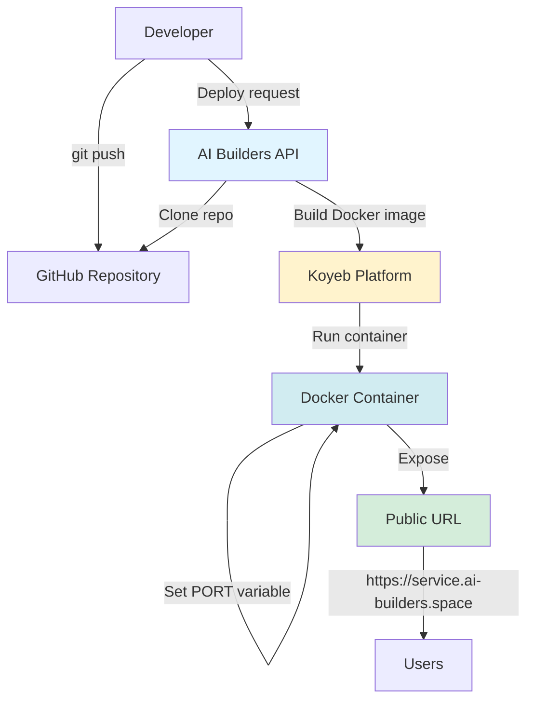

# S-00: System Architecture

**Version**: 1.1
**Last Updated**: 2025-12-09
**Status**: ✅ Spec Complete

---

## Quick Reference

**Purpose**: High-level system architecture for the Idea War Room MVP, an AI-powered MVTA (Multi-Vector Threat Analysis) platform for startup idea validation.

**Dependencies**: None (foundation document)

**Used By**:
- S-01: UI/UX Design System
- S-02: Testing Strategy
- S-03: Database Schema
- S-04: LLM Integration
- S-05: Search & Research Integration
- All Feature Specifications (F-01 through F-09)

---

## System Overview

Idea War Room is an AI-powered "war room" application that helps founders stress-test their startup ideas through structured Multi-Vector Threat Analysis (MVTA). The system combines:

1. **Structured Idea Intake**: Converts founder's raw idea into MVTA framework format
2. **Online Research Engine**: Pulls real-world evidence from Reddit, forums, reviews, and competitor analysis
3. **AI Red Team Simulation**: Simulates 5 professional adversarial roles attacking the idea across 18+ attack vectors
4. **Vulnerability Scoring**: Rates threats on 1-5 scale (catastrophic to resilient)
5. **Damage Report Generation**: Produces structured, actionable threat analysis with cascading failure chains
6. **Interactive Q&A**: Allows follow-up questions in the same session
7. **Export & History**: Saves analyses for future reference and comparison

**Target Session Duration**: 30-45 minutes per idea analysis

**Key Value Proposition**: First-time founders get professional-grade, evidence-backed pushback on their ideas in a single session, replacing weeks of ad-hoc feedback gathering.

---

## Architecture Diagram


---

## Tech Stack

### Frontend
- **Framework**: Next.js 16 (App Router) (16.1.6)
- **UI Library**: React 19 (19.2.4)
- **Styling**: Tailwind CSS 4 (4.1.18)
- **State Management**: React Context + hooks (no Redux for MVP)
- **Form Handling**: React Hook Form + Zod validation
- **Markdown Rendering**: react-markdown (for damage reports)
- **Copy to Clipboard**: navigator.clipboard API
- **TypeScript**: 5.x (strict mode)

### Backend
- **Runtime**: Node.js 20.x
- **API Framework**: Next.js API Routes
- **Language**: TypeScript 5.x
- **Validation**: Zod schemas
- **API Client**: fetch with custom wrappers

### Database & Auth
- **Database**: Supabase (PostgreSQL 15)
- **Auth**: JWT delegation from parent project (not Supabase Auth)
- **Session Management**: HTTP-only cookies
- **JWT Library**: jsonwebtoken (^9.0.2)
- **ORM**: Supabase Client SDK (database only)
- **Real-time**: Supabase Realtime (for session status updates)

### External Services
- **LLM Provider**: AI Builders API
  - Endpoint: https://space.ai-builders.com/backend/openapi.json
  - Purpose: MVTA analysis, prompt engineering, structured JSON extraction
- **Search Provider**: AI Builders API
  - Endpoint: https://space.ai-builders.com/backend/openapi.json
  - Purpose: Web research, competitor discovery, community listening

### Development Tools
- **Package Manager**: pnpm (fast, efficient)
- **Linting**: ESLint + Prettier
- **Testing**: Vitest (unit), Playwright (E2E)
- **Type Checking**: TypeScript compiler
- **Version Control**: Git

### Deployment
- **Platform**: Vercel (to be configured)
- **CI/CD**: Vercel automatic deployments
- **Environment Variables**: Vercel Environment Variables
- **Monitoring**: Vercel Analytics + Web Vitals

---

## System Modules

### Mandatory Foundation

#### [S-01: UI/UX Design System](./S-01-uiux-design.md)
- **Purpose**: Design language, component patterns, accessibility standards
- **Key Concepts**: Solopreneur.global-inspired aesthetic, professional typography, strategic whitespace
- **Dependencies**: None

#### [S-02: Testing Strategy](./S-02-testing-strategy.md)
- **Purpose**: Quality assurance, test pyramid, coverage goals
- **Key Concepts**: Tier 1 critical path tests, E2E → Integration → Unit
- **Dependencies**: None

### Project-Specific Modules

#### [S-03: Database Schema](./S-03-database-schema.md)
- **Purpose**: Data model for ideas, reports, sessions, users, feedback
- **Key Concepts**: PostgreSQL tables, RLS policies, indexes, relationships
- **Dependencies**: None

#### [S-04: LLM Integration](./S-04-llm-integration.md)
- **Purpose**: AI Builders API integration, prompt engineering, structured outputs
- **Key Concepts**: MVTA prompt templates, JSON schema validation, retry logic
- **Dependencies**: S-03 (stores results)

#### [S-05: Search & Research Integration](./S-05-search-research-integration.md)
- **Purpose**: Web research, competitor discovery, community listening
- **Key Concepts**: Query generation, result synthesis, evidence extraction
- **Dependencies**: S-04 (uses LLM for query generation)

---

## Design Principles

### 1. Progressive Disclosure
- Start with simple intake form (5-10 minutes)
- Show research phase progress (transparent AI work)
- Reveal damage report incrementally (executive summary → vector details → recommendations)

### 2. Evidence-First Analysis
- Every vulnerability must cite research evidence
- No generic AI platitudes ("this could be a problem")
- Clearly separate speculative risks from evidence-backed threats

### 3. Actionable Outputs
- Every critical vulnerability includes 1-2 next-step recommendations
- Recommendations are specific (e.g., "Interview 10 users in X segment") not vague (e.g., "do market research")

### 4. Single-Session Completeness
- Entire MVTA analysis completes in one sitting (30-45 min)
- No "come back later" or async processing (use streaming/progress indicators)
- User can export and leave with complete damage report

### 5. Transparency & Control
- Show AI reasoning (which research influenced which conclusion)
- Allow users to re-run analysis with different parameters
- Clearly mark AI-generated content

### 6. Cost Efficiency
- Batch LLM calls where possible
- Cache research results for similar ideas
- Use structured outputs (JSON mode) to reduce token waste

### 7. Failure Resilience
- Graceful degradation if research API fails (proceed with partial data)
- Retry logic for LLM timeouts
- Save partial progress (allow resume if user leaves mid-session)

---

## JWT Authentication Flow

The MVP uses JWT token delegation from a parent project for user authentication. Users authenticate with the parent project, which generates a signed JWT and redirects to the MVP.

### Authentication Architecture


### JWT Payload Structure

```json
{
  "sub": "parent-user-id",
  "email": "user@example.com",
  "name": "User Name",
  "iat": 1702345678,
  "exp": 1702349278,
  "metadata": {
    "company": "Acme Inc",
    "role": "founder"
  }
}
```

### Key Components

**JWT Validation** (`src/lib/auth/jwt.ts`):
- Verify signature using shared secret (HS256 algorithm)
- Validate expiration (iat, exp claims)
- Validate required fields (sub, email)

**User Management** (`src/lib/auth/user.ts`):
- Upsert user profile from JWT payload
- Map `external_user_id` to JWT `sub` claim
- Store email, name, metadata in `user_profiles` table

**Session Management** (`src/lib/auth/session.ts`):
- Set HTTP-only session cookie with JWT
- 7-day cookie lifetime (JWT expiration takes precedence)
- Secure, SameSite=Lax flags for security

**RLS Integration** (`src/lib/auth/middleware.ts`):
- Replace `auth.uid()` with custom `get_current_user_id()` function
- Set session variable via `set_session_user_id()` RPC call
- Enforce data isolation at database level

### Unauthorized Access Handling

- **No JWT token**: Redirect to `https://parent.com/login?redirect=https://mvp.com/...`
- **Expired JWT**: Redirect to parent login with redirect parameter
- **Invalid signature**: Redirect to parent login (security breach)
- **Logout**: Clear session cookie, redirect to parent

---

## Dev Mode Authentication

For local development without parent integration, the system supports **mock authentication**:

- **Mode**: Controlled by `AUTH_MODE` environment variable (`mock` or `jwt`)
- **Mock Users**: Hardcoded test users defined in `MOCK_USERS` env var
- **Mock Login**: UI at `/api/auth/mock/login` for selecting test user
- **JWT Generation**: Mock JWT with dev secret (not production secret)
- **Visual Indicator**: Yellow banner shows dev mode is active
- **Full Compatibility**: All features work identically in dev mode

**Use Cases**:
- Local development before parent integration ready
- Automated testing without external dependencies
- Feature demos without authentication complexity
- Multi-user testing (RLS policy verification)

**Security**: Mock endpoints return 403 in production mode (`AUTH_MODE=jwt`)

---

## Data Flow

### Primary User Journey: MVTA Analysis


---

## Security Considerations

### Authentication
- Supabase Auth with email/password or magic links
- Row-Level Security (RLS) policies ensure users only see their own ideas and reports

### Data Privacy
- No sharing of user ideas with third parties (beyond AI Builders API)
- Users can delete their data at any time
- Ideas are not used to train AI models

### API Security
- Rate limiting on API routes (prevent abuse)
- API key for AI Builders stored in environment variables (never client-side)
- Input validation with Zod schemas

### Content Security
- Sanitize user input (prevent XSS)
- Markdown rendering with safe settings (no arbitrary HTML)

---

## Performance Targets

### Response Times
- **Idea structuring**: <5 seconds
- **Research generation**: 15-30 seconds (with progress indicators)
- **MVTA analysis**: 30-60 seconds (with streaming/progress)
- **Follow-up Q&A**: <10 seconds per question

### Scalability
- **MVP Target**: 100 concurrent users
- **Database**: PostgreSQL can handle 1000s of ideas
- **LLM Rate Limits**: Respect AI Builders API rate limits (implement queueing if needed)

### Reliability
- **Uptime Target**: 99.5% (Vercel standard)
- **Error Rate**: <1% for successful API calls
- **Data Durability**: Supabase automatic backups

---

## Deployment Architecture

### Environments

1. **Development**: Local Next.js dev server + Supabase local
2. **Staging/Preview**: AI Builders Deployment (experimental feature)
3. **Production**: Vercel production (optional, for custom domains)

### AI Builder Deployment (Primary Deployment Method)

The project uses AI Builders Deployment as the primary deployment platform. This experimental feature provides:

- **Free Hosting**: 12 months from first successful deployment
- **Simple Deployment**: One-click deployment to `ai-builders.space`
- **Resource Limits**: 256 MB RAM (nano containers)
- **Service Limit**: Maximum 2 services per user (default)

#### Technical Requirements

**Dockerfile Configuration:**
- Single process serving both API and static files
- Must honor `PORT` environment variable (set by Koyeb at runtime)
- CMD instruction must use shell form: `CMD sh -c "next start -p ${PORT:-3000}"`
- Optimized for 256 MB RAM limit

**Environment Variables:**
- `AI_BUILDER_TOKEN`: Automatically injected by platform
- `PORT`: Set by Koyeb at runtime (must be honored)
- Other variables: Configured via `env_vars` in deployment request

**Deployment Process:**
1. Ensure Dockerfile and .dockerignore exist in project root
2. Configure deployment parameters in `deploy-config.json`
3. Push all changes to GitHub (deployment pulls from repo)
4. Call AI Builders Deployment API or use AI assistant
5. Wait 5-10 minutes for provisioning
6. Monitor status via Deployment Portal or API

**Public URL:**
- Format: `https://{service-name}.ai-builders.space`
- Example: `https://idea-war-room.ai-builders.space`

#### Deployment Architecture Diagram



### Environment Variables

#### Development (.env.local)
```bash
# Supabase
NEXT_PUBLIC_SUPABASE_URL=https://xxx.supabase.co
NEXT_PUBLIC_SUPABASE_ANON_KEY=eyJxxx...
SUPABASE_SERVICE_ROLE_KEY=eyJxxx... # Server-side only

# AI Builders API
AI_BUILDER_TOKEN=sk_xxx... # For local development
AI_BUILDERS_API_URL=https://space.ai-builders.com/backend

# Authentication
AUTH_MODE=mock # or jwt
JWT_SECRET=your-shared-secret-key
PARENT_LOGIN_URL=https://parent.example.com/login

# App
NEXT_PUBLIC_APP_URL=http://localhost:3000
NODE_ENV=development
```

#### Production (AI Builders Deployment)
```bash
# Automatically injected by platform
AI_BUILDER_TOKEN=sk_xxx... # Injected by deployment platform
PORT=8000 # Set by Koyeb at runtime

# Required via env_vars in deploy-config.json
NEXT_PUBLIC_SUPABASE_URL=https://xxx.supabase.co
NEXT_PUBLIC_SUPABASE_ANON_KEY=eyJxxx...
SUPABASE_SERVICE_ROLE_KEY=eyJxxx...
AUTH_MODE=jwt
JWT_SECRET=your-shared-secret-key
PARENT_LOGIN_URL=https://parent.example.com/login
NEXT_PUBLIC_APP_URL=https://idea-war-room.ai-builders.space
NODE_ENV=production
```

### CI/CD Pipeline

#### AI Builder Deployment (Primary)
1. Developer commits and pushes changes to GitHub
2. Developer triggers deployment via API or AI assistant
3. Platform clones repository from specified branch
4. Docker image built using Dockerfile
5. Container deployed to Koyeb with injected environment variables
6. Service available at `https://{service-name}.ai-builders.space`
7. Monitor status via Deployment Portal or API

#### Optional: Vercel Deployment
1. Push to branch → Vercel preview deployment
2. PR merge to main → Vercel production deployment
3. Automatic TypeScript type checking
4. Automatic ESLint checks
5. Run E2E tests on preview (future enhancement)

---

## Related Documents

### System Modules
- [S-01: UI/UX Design System](./S-01-uiux-design.md)
- [S-02: Testing Strategy](./S-02-testing-strategy.md)
- [S-03: Database Schema](./S-03-database-schema.md)
- [S-04: LLM Integration](./S-04-llm-integration.md)
- [S-05: Search & Research Integration](./S-05-search-research-integration.md)

### Features
- [F-01: External Authentication Integration](../features/F-01-database-auth.md)
- [F-02: Idea Intake Form](../features/F-02-idea-intake-form.md)
- [F-03: Idea Analysis Choice Page](../features/F-03-idea-analysis-choice-page.md)
- [F-04: MVTA Red Team Simulation](../features/F-04-mvta-red-team-simulation.md)
- [F-05: Damage Report Display](../features/F-05-damage-report-display.md)
- [F-06: Interactive Q&A Session](../features/F-06-interactive-qa-session.md)
- [F-07: Export & Sharing](../features/F-07-export-sharing.md)
- [F-08: Research Engine](../features/F-08-research-engine.md)
- [F-09: Session History](../features/F-09-session-history.md)
- [F-10: Feedback Collection](../features/F-10-feedback-collection.md)

---

## Notes

### Future Enhancements (Post-MVP)
- Multi-language support (Spanish, Chinese)
- Collaborative analysis (team can comment on damage report)
- Idea comparison mode (side-by-side damage reports)
- MVTA template customization (add custom attack vectors)
- Integration with pitch deck tools (export directly to Notion, Google Slides)

### Known Limitations
- MVP focuses on single-user experience (no team collaboration)
- English-only for MVP
- Research depth limited by AI Builders API capabilities
- No real-time collaboration features

### References
- MVTA Framework: (original framework documentation)
- solopreneur.global: UI design inspiration
- AI Builders API Documentation: https://space.ai-builders.com/backend/openapi.json
