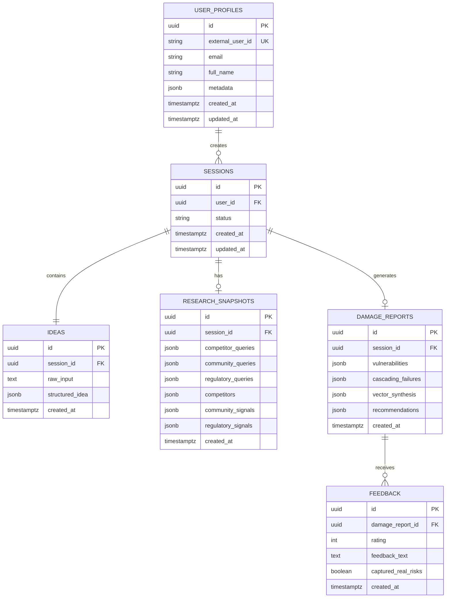

# S-03: Database Schema

**Version**: 1.2
**Last Updated**: 2025-12-15
**Status**: ✅ Spec Complete

---

## Quick Reference

**Purpose**: Complete data model for Idea War Room, including tables, relationships, indexes, and Row-Level Security (RLS) policies for Supabase PostgreSQL.

**Dependencies**: None

**Used By**:
- S-04: LLM Integration (stores analysis results)
- S-05: Search & Research Integration (stores research snapshots)
- F-01: Database & Authentication (implements schema)
- F-02: Idea Intake Form (writes to ideas table)
- F-04: MVTA Red Team Simulation (writes to damage_reports table)
- F-09: Session History (queries sessions and reports)

---

## Database Technology

**Platform**: Supabase (managed PostgreSQL 15)

**Key Features Used**:
- **Row-Level Security (RLS)**: User data isolation via custom functions (not Supabase Auth)
- **Realtime Subscriptions**: Session status updates (optional for MVP)
- **Auto-generated REST API**: Client SDK for CRUD operations
- **UUID Primary Keys**: Globally unique identifiers
- **Timestamptz**: Timezone-aware timestamps

**Authentication**: Uses JWT delegation from parent project (not Supabase Auth). Custom RLS functions (`get_current_user_id()`) replace `auth.uid()` for data isolation.

---

## Schema Overview

### Entity Relationship Diagram



---

## Custom RLS Functions

**Purpose**: Replace Supabase Auth's `auth.uid()` with custom session-based user identification for JWT authentication from parent project.

### get_current_user_id()

Returns the current authenticated user's UUID from the session context.

```sql
CREATE OR REPLACE FUNCTION get_current_user_id()
RETURNS UUID AS $$
  SELECT NULLIF(current_setting('app.current_user_id', true), '')::uuid;
$$ LANGUAGE sql STABLE;
```

**Usage**: Used in all RLS policies to enforce data isolation based on session-set user ID.

**How it works**:
1. Application middleware sets `app.current_user_id` session variable when validating JWT
2. RLS policies call `get_current_user_id()` to get authenticated user's ID
3. Returns NULL if session variable not set (unauthenticated request)

### set_session_user_id()

Helper function to set the current user ID in the session context (called by application middleware).

```sql
CREATE OR REPLACE FUNCTION set_session_user_id(user_id UUID)
RETURNS void AS $$
BEGIN
  PERFORM set_config('app.current_user_id', user_id::text, false);
END;
$$ LANGUAGE plpgsql;
```

**Usage**: Called by API middleware after validating JWT token.

**Example**:
```typescript
// In API middleware after JWT validation
await supabase.rpc('set_session_user_id', { user_id: authenticatedUser.id });
```

**Security Note**: This function should only be callable by authenticated connections (service role key). RLS policies prevent unauthorized access even if session variable is manipulated.

---

## ⚠️ CRITICAL: Service Role Key Security

### The Problem

**Supabase Service Role Key bypasses ALL Row-Level Security (RLS) policies.**

While RLS policies are defined in the database and enforced for connections using the anonymous key, **connections using the service role key have admin privileges and ignore RLS entirely**.

### Why This Matters

The application uses service role key for server-side operations (`createServerSupabaseClient()`). This means:

❌ **WRONG ASSUMPTION**: "RLS will automatically filter data by user"
✅ **REALITY**: Service role queries see ALL data across ALL users

### Security Vulnerability Example

```typescript
// ❌ VULNERABLE - Service role key bypasses RLS
const { data } = await supabase  // Using service role key
  .from('sessions')
  .select('*')
  .eq('id', sessionId);  // Only checks sessionId, NO user_id filter

// Result: ANY user can access ANY session by knowing the ID
```

### Required Solution

**Every query that accesses user-scoped data MUST explicitly filter by `user_id`:**

```typescript
// ✅ SECURE - Explicit user_id filtering
const { data } = await supabase
  .from('sessions')
  .select('*')
  .eq('id', sessionId)
  .eq('user_id', user.id);  // CRITICAL: Explicitly filter by user

// Result: Users can only access their own data
```

### Authorization Pattern

**Use `verifySessionOwnership()` utility function** (see implementation in `/src/lib/auth/session-ownership.ts`):

```typescript
import { verifySessionOwnership } from '@/lib/auth/session-ownership';

export async function GET(
  request: NextRequest,
  { params }: { params: { sessionId: string } }
) {
  const { supabase, user } = await createAuthenticatedSupabaseClient();

  // CRITICAL: Verify ownership BEFORE accessing data
  const { authorized, session, error } = await verifySessionOwnership(
    supabase,
    params.sessionId,
    user.id
  );

  if (!authorized) {
    return NextResponse.json(
      { error: error || 'Session not found or access denied' },
      { status: 404 }
    );
  }

  // Safe to proceed - user owns this session
}
```

### Implementation Checklist

For ANY API endpoint that accesses user data:

- [ ] Call `createAuthenticatedSupabaseClient()` to get authenticated user
- [ ] Verify `user` is not null (return 401 if missing)
- [ ] Use `verifySessionOwnership()` for session-scoped operations
- [ ] OR add `.eq('user_id', user.id)` to ALL queries that fetch user data
- [ ] Test with multiple users to verify isolation
- [ ] Return 404 (not 403) for unauthorized access to avoid leaking resource existence

### Why Not Use Anonymous Key?

The service role key is needed because:
1. Server-side operations require bypassing rate limits
2. Some operations (like batch updates) need elevated privileges
3. The application uses custom JWT auth (not Supabase Auth)

The trade-off is that we must manually enforce authorization in application code.

---

## Table Definitions

### 1. user_profiles

**Purpose**: Store user account information from parent project authentication

**Schema**:
```sql
CREATE TABLE user_profiles (
  id UUID PRIMARY KEY DEFAULT uuid_generate_v4(),
  external_user_id TEXT NOT NULL UNIQUE,
  email TEXT NOT NULL UNIQUE,
  full_name TEXT,
  metadata JSONB DEFAULT '{}'::jsonb,
  created_at TIMESTAMPTZ DEFAULT NOW(),
  updated_at TIMESTAMPTZ DEFAULT NOW()
);

-- Indexes
CREATE INDEX idx_user_profiles_email ON user_profiles(email);
CREATE INDEX idx_user_profiles_external_user_id ON user_profiles(external_user_id);

-- RLS Policies
ALTER TABLE user_profiles ENABLE ROW LEVEL SECURITY;

CREATE POLICY "Users can view own profile"
  ON user_profiles FOR SELECT
  USING (get_current_user_id() = id);

CREATE POLICY "Users can update own profile"
  ON user_profiles FOR UPDATE
  USING (get_current_user_id() = id);

-- Trigger: Update updated_at on modification
CREATE OR REPLACE FUNCTION update_updated_at_column()
RETURNS TRIGGER AS $$
BEGIN
  NEW.updated_at = NOW();
  RETURN NEW;
END;
$$ LANGUAGE plpgsql;

CREATE TRIGGER update_user_profiles_updated_at
  BEFORE UPDATE ON user_profiles
  FOR EACH ROW
  EXECUTE FUNCTION update_updated_at_column();
```

**Notes**:
- `id`: Internal UUID (primary key, not linked to Supabase Auth)
- `external_user_id`: Parent project's user ID (mapped from JWT `sub` claim)
- `metadata`: Additional user data from parent project (stored as JSONB)
- RLS uses custom `get_current_user_id()` function instead of `auth.uid()`
- **Dev Mode**: In dev mode (`AUTH_MODE=mock`), the `external_user_id` will be test user IDs like `test-user-1`, `test-user-2`. The same table structure works for both dev and production modes.

---

### 2. sessions

**Purpose**: Track MVTA analysis sessions (one session = one complete analysis from intake to damage report)

**Schema**:
```sql
CREATE TABLE sessions (
  id UUID PRIMARY KEY DEFAULT uuid_generate_v4(),
  user_id UUID NOT NULL REFERENCES user_profiles(id) ON DELETE CASCADE,
  status TEXT NOT NULL DEFAULT 'intake' CHECK (status IN ('intake', 'choice', 'completed', 'failed')),
  research_completed BOOLEAN DEFAULT FALSE,
  analysis_completed BOOLEAN DEFAULT FALSE,
  created_at TIMESTAMPTZ DEFAULT NOW(),
  updated_at TIMESTAMPTZ DEFAULT NOW()
);

-- Indexes
CREATE INDEX idx_sessions_user_id ON sessions(user_id);
CREATE INDEX idx_sessions_status ON sessions(status);
CREATE INDEX idx_sessions_created_at ON sessions(created_at DESC);
CREATE INDEX idx_sessions_completion ON sessions(research_completed, analysis_completed);

-- RLS Policies
ALTER TABLE sessions ENABLE ROW LEVEL SECURITY;

CREATE POLICY "Users can view own sessions"
  ON sessions FOR SELECT
  USING (get_current_user_id() = user_id);

CREATE POLICY "Users can insert own sessions"
  ON sessions FOR INSERT
  WITH CHECK (get_current_user_id() = user_id);

CREATE POLICY "Users can update own sessions"
  ON sessions FOR UPDATE
  USING (get_current_user_id() = user_id);

CREATE POLICY "Users can delete own sessions"
  ON sessions FOR DELETE
  USING (get_current_user_id() = user_id);

-- Trigger: Update updated_at
CREATE TRIGGER update_sessions_updated_at
  BEFORE UPDATE ON sessions
  FOR EACH ROW
  EXECUTE FUNCTION update_updated_at_column();
```

**Status Transitions** (Branching Workflow):
```
intake → choice ──┬→ (research) → research_completed=true → choice
                  │
                  └→ (analysis) → analysis_completed=true + status='completed'
```

**Completion Flags**:
- `research_completed`: TRUE if research has been run at least once
- `analysis_completed`: TRUE if MVTA analysis has been run at least once
- Both flags allow re-running (users can repeat either action)

**Notes**:
- Session starts with status='intake'
- After intake form submission (F-02), status changes to 'choice'
- User lands on Choice Page (F-03) where they can select:
  - Research (F-08): Sets `research_completed=true`, keeps status='choice', returns to Choice Page
  - MVTA (F-04): Sets `analysis_completed=true` AND changes status='completed'
- Users can complete both features in any order
- MVTA analysis is the primary output (triggers status='completed')
- Each session represents one idea analysis (user can create multiple sessions)

---

### 3. ideas

**Purpose**: Store raw idea input and structured MVTA-formatted idea

**Schema**:
```sql
CREATE TABLE ideas (
  id UUID PRIMARY KEY DEFAULT uuid_generate_v4(),
  session_id UUID NOT NULL UNIQUE REFERENCES sessions(id) ON DELETE CASCADE,
  raw_input TEXT NOT NULL,
  structured_idea JSONB NOT NULL,
  created_at TIMESTAMPTZ DEFAULT NOW()
);

-- Indexes
CREATE INDEX idx_ideas_session_id ON ideas(session_id);
CREATE INDEX idx_ideas_created_at ON ideas(created_at DESC);

-- GIN index for JSONB queries (search within structured_idea)
CREATE INDEX idx_ideas_structured_idea_gin ON ideas USING GIN (structured_idea);

-- RLS Policies
ALTER TABLE ideas ENABLE ROW LEVEL SECURITY;

CREATE POLICY "Users can view own ideas"
  ON ideas FOR SELECT
  USING (
    EXISTS (
      SELECT 1 FROM sessions
      WHERE sessions.id = ideas.session_id
      AND sessions.user_id = get_current_user_id()
    )
  );

CREATE POLICY "Users can insert own ideas"
  ON ideas FOR INSERT
  WITH CHECK (
    EXISTS (
      SELECT 1 FROM sessions
      WHERE sessions.id = ideas.session_id
      AND sessions.user_id = get_current_user_id()
    )
  );
```

**structured_idea JSONB Schema**:
```json
{
  "high_concept": "string",
  "value_proposition": "string",
  "success_metric_18m": "string",
  "assumptions": {
    "market": ["string"],
    "technical": ["string"],
    "business_model": ["string"]
  },
  "assets": {
    "key_assets": ["string"],
    "brand_narrative": ["string"]
  },
  "environment": {
    "user_persona": "string",
    "competitive_landscape": "string",
    "regulatory_context": "string"
  }
}
```

**Notes**:
- One-to-one relationship with sessions (UNIQUE constraint on session_id)
- `raw_input`: Founder's original description (unprocessed)
- `structured_idea`: LLM-processed MVTA format (Prompt A output)

---

### 4. research_snapshots

**Purpose**: Store generated research queries and fetched results (competitors, community signals, regulatory context)

**Schema**:
```sql
CREATE TABLE research_snapshots (
  id UUID PRIMARY KEY DEFAULT uuid_generate_v4(),
  session_id UUID NOT NULL UNIQUE REFERENCES sessions(id) ON DELETE CASCADE,

  -- Generated queries
  competitor_queries JSONB DEFAULT '[]'::jsonb,
  community_queries JSONB DEFAULT '[]'::jsonb,
  regulatory_queries JSONB DEFAULT '[]'::jsonb,

  -- Fetched results
  competitors JSONB DEFAULT '[]'::jsonb,
  community_signals JSONB DEFAULT '[]'::jsonb,
  regulatory_signals JSONB DEFAULT '[]'::jsonb,

  created_at TIMESTAMPTZ DEFAULT NOW()
);

-- Indexes
CREATE INDEX idx_research_snapshots_session_id ON research_snapshots(session_id);
CREATE INDEX idx_research_snapshots_gin ON research_snapshots USING GIN (competitors, community_signals, regulatory_signals);

-- RLS Policies
ALTER TABLE research_snapshots ENABLE ROW LEVEL SECURITY;

CREATE POLICY "Users can view own research"
  ON research_snapshots FOR SELECT
  USING (
    EXISTS (
      SELECT 1 FROM sessions
      WHERE sessions.id = research_snapshots.session_id
      AND sessions.user_id = get_current_user_id()
    )
  );

CREATE POLICY "Users can insert own research"
  ON research_snapshots FOR INSERT
  WITH CHECK (
    EXISTS (
      SELECT 1 FROM sessions
      WHERE sessions.id = research_snapshots.session_id
      AND sessions.user_id = get_current_user_id()
    )
  );
```

**JSONB Schemas**:

```typescript
// competitor_queries: Array<string>
["best email marketing SaaS", "Mailchimp alternatives 2025"]

// community_queries: Array<string>
["email marketing pain points reddit", "SMB email automation complaints"]

// regulatory_queries: Array<string>
["email marketing GDPR compliance", "CAN-SPAM act requirements"]

// competitors: Array<CompetitorResult>
[
  {
    "name": "Mailchimp",
    "url": "https://mailchimp.com",
    "summary": "Leading email marketing platform with 80% market share",
    "pricing": "Starts at $10/mo",
    "strengths": ["Deep integrations", "Large template library"],
    "weaknesses": ["Complex UI", "Expensive at scale"]
  }
]

// community_signals: Array<CommunitySignal>
[
  {
    "source": "reddit",
    "url": "https://reddit.com/r/smallbusiness/...",
    "title": "Anyone else frustrated with Mailchimp pricing?",
    "snippet": "We're paying $300/mo and it's killing our budget...",
    "sentiment": "negative",
    "themes": ["pricing", "affordability"]
  }
]

// regulatory_signals: Array<RegulatorySignal>
[
  {
    "regulation": "GDPR",
    "summary": "Requires explicit consent for email marketing in EU",
    "compliance_requirements": ["Consent checkboxes", "Easy unsubscribe", "Data export"],
    "penalties": "Up to €20M or 4% revenue"
  }
]
```

**Notes**:
- One-to-one relationship with sessions
- Queries generated by LLM (Prompt B)
- Results fetched by AI Builders Search API

---

### 5. damage_reports

**Purpose**: Store complete MVTA analysis results (vulnerabilities, scoring, cascading failures, recommendations)

**Schema**:
```sql
CREATE TABLE damage_reports (
  id UUID PRIMARY KEY DEFAULT uuid_generate_v4(),
  session_id UUID NOT NULL UNIQUE REFERENCES sessions(id) ON DELETE CASCADE,

  vulnerabilities JSONB NOT NULL,
  cascading_failures JSONB NOT NULL,
  vector_synthesis JSONB NOT NULL,
  recommendations JSONB NOT NULL,

  created_at TIMESTAMPTZ DEFAULT NOW()
);

-- Indexes
CREATE INDEX idx_damage_reports_session_id ON damage_reports(session_id);
CREATE INDEX idx_damage_reports_gin ON damage_reports USING GIN (vulnerabilities, cascading_failures, vector_synthesis, recommendations);

-- RLS Policies
ALTER TABLE damage_reports ENABLE ROW LEVEL SECURITY;

CREATE POLICY "Users can view own reports"
  ON damage_reports FOR SELECT
  USING (
    EXISTS (
      SELECT 1 FROM sessions
      WHERE sessions.id = damage_reports.session_id
      AND sessions.user_id = get_current_user_id()
    )
  );

CREATE POLICY "Users can insert own reports"
  ON damage_reports FOR INSERT
  WITH CHECK (
    EXISTS (
      SELECT 1 FROM sessions
      WHERE sessions.id = damage_reports.session_id
      AND sessions.user_id = get_current_user_id()
    )
  );
```

**JSONB Schemas**:

```typescript
// vulnerabilities: Array<Vulnerability>
[
  {
    "vector": "Market & Economic Viability",
    "simulation": "Competitor War Game",
    "description": "Mailchimp dominates with 80% market share and deep integrations",
    "score": 2, // 1-5 scale
    "rationale": "Based on 3 competitor analyses and 12 user reviews indicating strong lock-in",
    "evidence_refs": {
      "competitors": [0, 1], // Indices in research_snapshots.competitors
      "community_signals": ["signal_1", "signal_2"], // References to community_signals
      "regulatory_signals": []
    }
  }
]

// cascading_failures: Array<CascadingFailure>
[
  {
    "chain": [
      "Mailchimp launches similar feature",
      "Users perceive no differentiation",
      "Customer churn accelerates",
      "Revenue drops below sustainability threshold",
      "Business fails"
    ],
    "severity": 1, // 1-5 scale
    "narrative": "If Mailchimp replicates your core feature within 6 months (high likelihood given their R&D budget), users will have no compelling reason to switch. Historical data shows 70% churn rate for 'me-too' products in email marketing space. This triggers a death spiral: churn → revenue drop → inability to invest in differentiation → more churn."
  }
]

// vector_synthesis: Array<VectorSummary>
[
  {
    "vector": "Market & Economic Viability",
    "summary": "High competitive pressure from entrenched players. Market is saturated but has pockets of unmet needs (SMBs frustrated with pricing complexity). Differentiation strategy critical.",
    "overall_score": 2 // Worst score among vulnerabilities in this vector
  }
]

// recommendations: Array<Recommendation>
[
  {
    "risk_index": 0, // Index in vulnerabilities array
    "action_type": "Customer Discovery", // One of: Customer Discovery, Pricing Experiment, Technical Spike, Compliance Review, Narrative Test, Other
    "description": "Interview 20 SMB owners (10-50 employees) currently using Mailchimp. Focus on: (1) What nearly made them cancel? (2) What features do they pay for but never use? (3) What would they pay 2x for?"
  }
]
```

**Notes**:
- One-to-one relationship with sessions
- Generated by LLM (Prompt C: MVTA Red Team analysis)
- This is the core output users see in the Damage Report UI

---

### 6. feedback

**Purpose**: Collect user feedback on damage report quality (used for prompt tuning and quality monitoring)

**Schema**:
```sql
CREATE TABLE feedback (
  id UUID PRIMARY KEY DEFAULT uuid_generate_v4(),
  damage_report_id UUID NOT NULL REFERENCES damage_reports(id) ON DELETE CASCADE,

  rating INTEGER CHECK (rating >= 1 AND rating <= 5),
  feedback_text TEXT,
  captured_real_risks BOOLEAN,

  created_at TIMESTAMPTZ DEFAULT NOW()
);

-- Indexes
CREATE INDEX idx_feedback_damage_report_id ON feedback(damage_report_id);
CREATE INDEX idx_feedback_created_at ON feedback(created_at DESC);
CREATE INDEX idx_feedback_rating ON feedback(rating);

-- RLS Policies
ALTER TABLE feedback ENABLE ROW LEVEL SECURITY;

CREATE POLICY "Users can view own feedback"
  ON feedback FOR SELECT
  USING (
    EXISTS (
      SELECT 1 FROM damage_reports
      JOIN sessions ON damage_reports.session_id = sessions.id
      WHERE damage_reports.id = feedback.damage_report_id
      AND sessions.user_id = get_current_user_id()
    )
  );

CREATE POLICY "Users can insert own feedback"
  ON feedback FOR INSERT
  WITH CHECK (
    EXISTS (
      SELECT 1 FROM damage_reports
      JOIN sessions ON damage_reports.session_id = sessions.id
      WHERE damage_reports.id = feedback.damage_report_id
      AND sessions.user_id = get_current_user_id()
    )
  );
```

**Notes**:
- Many-to-one relationship with damage_reports (user can submit feedback multiple times, though UI should limit to once per report)
- `rating`: 1-5 stars
- `feedback_text`: Optional free-form feedback
- `captured_real_risks`: Boolean question: "Did this capture your real risks?"

---

## Queries & Usage Patterns

### Common Queries

#### 1. Get User's Session History (Most Recent First)

```sql
SELECT
  s.id AS session_id,
  s.status,
  s.created_at,
  i.raw_input,
  i.structured_idea->>'high_concept' AS high_concept,
  dr.id AS damage_report_id
FROM sessions s
LEFT JOIN ideas i ON i.session_id = s.id
LEFT JOIN damage_reports dr ON dr.session_id = s.id
WHERE s.user_id = get_current_user_id()
ORDER BY s.created_at DESC
LIMIT 10;
```

#### 2. Get Complete Session Data (Idea + Research + Report)

```sql
SELECT
  s.id AS session_id,
  s.status,
  i.structured_idea,
  r.competitors,
  r.community_signals,
  dr.vulnerabilities,
  dr.cascading_failures,
  dr.recommendations
FROM sessions s
JOIN ideas i ON i.session_id = s.id
LEFT JOIN research_snapshots r ON r.session_id = s.id
LEFT JOIN damage_reports dr ON dr.session_id = s.id
WHERE s.id = $1
AND s.user_id = get_current_user_id();
```

#### 3. Get All Vulnerabilities for a Vector

```sql
SELECT
  jsonb_array_elements(vulnerabilities) AS vulnerability
FROM damage_reports
WHERE session_id = $1
AND jsonb_array_elements(vulnerabilities)->>'vector' = 'Market & Economic Viability';
```

#### 4. Analytics: Average Report Rating

```sql
SELECT
  AVG(rating) AS avg_rating,
  COUNT(*) AS feedback_count,
  COUNT(CASE WHEN captured_real_risks = true THEN 1 END)::FLOAT / COUNT(*) AS accuracy_rate
FROM feedback
JOIN damage_reports ON feedback.damage_report_id = damage_reports.id
JOIN sessions ON damage_reports.session_id = sessions.id
WHERE sessions.user_id = get_current_user_id();
```

---

## Migration Strategy

### Initial Migration (Empty Database → Full Schema)

**File**: `supabase/migrations/001_initial_schema.sql`

```sql
-- Enable UUID extension
CREATE EXTENSION IF NOT EXISTS "uuid-ossp";

-- Create user_profiles table
CREATE TABLE user_profiles (
  -- (Full schema as above)
);

-- Create sessions table
CREATE TABLE sessions (
  -- (Full schema as above)
);

-- (Continue for all tables...)

-- Create indexes, RLS policies, triggers
-- (As defined above for each table)
```

### Applying Migrations

```bash
# Local development
supabase db reset
supabase db push

# Production
supabase db push --db-url $SUPABASE_DB_URL
```

---

## Performance Considerations

### Indexes

**Primary Indexes** (Already Defined):
- Primary keys (UUID): Automatically indexed
- Foreign keys: Explicitly indexed for JOIN performance
- `created_at` fields: Indexed DESC for "most recent" queries

**GIN Indexes for JSONB**:
- Enables fast queries within JSONB fields
- Used for searching ideas, research snapshots, damage reports

**Query Performance Targets**:
- Session history query: <50ms
- Complete session data query: <100ms
- Damage report rendering: <200ms

### Scaling Considerations

**Current Design** (MVP):
- Handles 10,000+ users with 100,000+ sessions
- PostgreSQL can scale vertically (Supabase offers up to 64GB RAM)

**Future Optimizations** (Post-MVP):
- Add read replicas for analytics queries
- Implement caching layer (Redis) for frequently accessed reports
- Archive old sessions (>6 months) to cold storage

---

## Data Privacy & Retention

### User Data Ownership
- Users own all their ideas, research, and reports
- RLS policies enforce strict data isolation (users can only access their own data)

### Data Deletion
- User deletes account → CASCADE deletes all sessions, ideas, research, reports, feedback
- User deletes specific session → CASCADE deletes associated idea, research, report

### Data Retention (Future Consideration)
- Anonymous analytics: Aggregate feedback ratings (no PII)
- No training on user ideas (explicitly stated in privacy policy)

---

## Related Documents

- [S-00: Architecture Overview](./S-00-architecture.md)
- [S-04: LLM Integration](./S-04-llm-integration.md) - Uses structured_idea and research_snapshots
- [S-05: Search & Research Integration](./S-05-search-research-integration.md) - Writes to research_snapshots
- [F-01: Database & Authentication](../features/F-01-database-auth.md) - Implements this schema
- [F-04: MVTA Red Team Simulation](../features/F-04-mvta-red-team-simulation.md) - Writes to damage_reports

---

## Notes

### Design Decisions

**Why JSONB for complex data?**
- Flexibility: MVTA format may evolve (easy to add fields without migrations)
- Performance: GIN indexes enable fast queries within JSON
- Developer Experience: Easy to serialize/deserialize from TypeScript types

**Why one-to-one relationships (sessions ↔ ideas ↔ reports)?**
- Simplifies data model (one session = one analysis)
- Easy to extend later (e.g., allow re-running analysis on same idea = new session)

**Why not separate tables for vulnerabilities, cascading_failures, etc.?**
- Damage report is always consumed as a whole (never querying individual vulnerabilities)
- JSONB reduces JOIN complexity
- Easier to export (single row = complete report)

### Known Limitations

- No versioning for ideas/reports (future: track edits)
- No collaboration features (future: shared sessions)
- No soft deletes (future: add `deleted_at` column)
