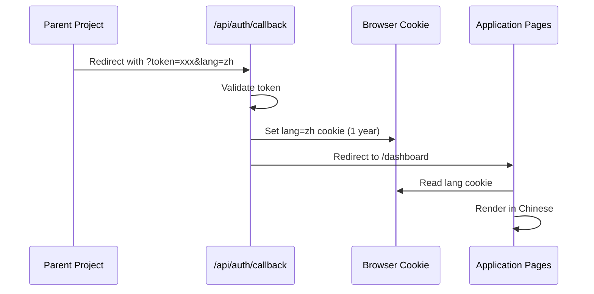

# S-06: Internationalization (i18n)

**Version**: 1.1
**Last Updated**: 2025-12-19
**Status**: ✅ Spec Complete

---

## Quick Reference

**Purpose**: Enable Chinese/English bilingual support for Idea War Room, allowing users from parent project to access the application in their preferred language.

**Dependencies**:
- S-01: UI/UX Design System (font considerations)
- S-04: LLM Integration (language-aware prompts)
- Parent JWT Integration (language parameter passing)

**Used By**: All feature specifications (F-01 through F-10)

---

## Overview

### Language Detection Flow



### Key Constraints

1. **Language from Parent Only**: Language is determined by parent project, not user selection
2. **No Language Switching**: Users cannot change language within the application
3. **Cookie-Based Persistence**: Language stored in HTTP cookie, read on every page load
4. **Preserve Technical Terms**: MVTA, ROI, and other technical terms remain in English

---

## Architecture

### Technology Choice: Context + JSON Translation Files

**Why not next-intl or react-i18next?**
- Language is fixed at entry (no runtime switching needed)
- No URL path localization required (no `/zh/dashboard`)
- Lightweight solution with zero external dependencies
- Full control over AI prompt internationalization

### Directory Structure

```
src/
├── i18n/
│   ├── locales/
│   │   ├── en.json              # English translations
│   │   └── zh.json              # Chinese translations
│   ├── context.tsx              # LanguageContext provider
│   ├── hooks.ts                 # useTranslation hook
│   ├── types.ts                 # TypeScript types for translations
│   ├── constants.ts             # Sample data per language
│   └── get-language.ts          # Server-side language detection
```

---

## Implementation Details

### 1. Language Detection (Server-Side)

**File**: `/src/i18n/get-language.ts`

```typescript
import { cookies } from 'next/headers';

export type Language = 'en' | 'zh';
export const DEFAULT_LANGUAGE: Language = 'en';
export const SUPPORTED_LANGUAGES: Language[] = ['en', 'zh'];

/**
 * Get language from cookie (server-side)
 * Returns default language if cookie not set or invalid
 */
export function getLanguage(): Language {
  const cookieStore = cookies();
  const lang = cookieStore.get('lang')?.value;

  if (lang && SUPPORTED_LANGUAGES.includes(lang as Language)) {
    return lang as Language;
  }

  return DEFAULT_LANGUAGE;
}
```

### 2. Auth Callback Modification

**File**: `/app/api/auth/callback/route.ts`

```typescript
export async function GET(request: NextRequest) {
  const url = new URL(request.url);
  const token = url.searchParams.get('token');
  const lang = url.searchParams.get('lang') || 'en';

  // Validate language
  const validLang = ['en', 'zh'].includes(lang) ? lang : 'en';

  // ... existing token validation ...

  // Set language cookie
  response.cookies.set('lang', validLang, {
    httpOnly: false,        // Accessible from client-side
    secure: process.env.NODE_ENV === 'production',
    sameSite: 'lax',
    maxAge: 60 * 60 * 24 * 365, // 1 year
    path: '/',
  });

  return response;
}
```

### 3. Language Context (Client-Side)

**File**: `/src/i18n/context.tsx`

```typescript
'use client';

import { createContext, useContext, ReactNode } from 'react';
import type { Language } from './get-language';

interface LanguageContextType {
  language: Language;
  t: (key: string, params?: Record<string, string | number>) => string;
}

const LanguageContext = createContext<LanguageContextType | null>(null);

export function LanguageProvider({
  children,
  language,
  translations,
}: {
  children: ReactNode;
  language: Language;
  translations: Record<string, any>;
}) {
  const t = (key: string, params?: Record<string, string | number>): string => {
    const keys = key.split('.');
    let value: any = translations;

    for (const k of keys) {
      value = value?.[k];
    }

    if (typeof value !== 'string') {
      console.warn(`Translation missing for key: ${key}`);
      return key;
    }

    // Replace placeholders like {count}
    if (params) {
      return value.replace(/\{(\w+)\}/g, (_, name) =>
        String(params[name] ?? `{${name}}`)
      );
    }

    return value;
  };

  return (
    <LanguageContext.Provider value={{ language, t }}>
      {children}
    </LanguageContext.Provider>
  );
}

export function useLanguage() {
  const context = useContext(LanguageContext);
  if (!context) {
    throw new Error('useLanguage must be used within LanguageProvider');
  }
  return context;
}
```

### 4. Layout Integration

**File**: `/app/layout.tsx`

```typescript
import { LanguageProvider } from '@/i18n/context';
import { getLanguage } from '@/i18n/get-language';
import en from '@/i18n/locales/en.json';
import zh from '@/i18n/locales/zh.json';

const translations = { en, zh };

export default function RootLayout({ children }) {
  const language = getLanguage();

  return (
    <html lang={language}>
      <body>
        <LanguageProvider
          language={language}
          translations={translations[language]}
        >
          {children}
        </LanguageProvider>
      </body>
    </html>
  );
}
```

---

## Translation File Structure

### English (`/src/i18n/locales/en.json`)

```json
{
  "common": {
    "loading": "Loading...",
    "error": "Error",
    "submit": "Submit",
    "next": "Next",
    "back": "Back"
  },
  "home": {
    "title": "Idea War Room",
    "subtitle": "AI-powered Idea Analysis and Validation"
  },
  "dashboard": {
    "welcome": "Welcome to Idea War Room",
    "startNewAnalysis": "Start New Analysis",
    "recentSessions": "Recent Sessions"
  },
  "intake": {
    "step1Title": "Core Concept",
    "highConceptLabel": "Describe your idea in one sentence"
  },
  "research": {
    "types": {
      "competitor": {
        "label": "Competitor Research",
        "description": "Discover competitor products, pricing strategies, and market positioning."
      }
    }
  },
  "report": {
    "severity": {
      "1": "Catastrophic",
      "2": "Critical",
      "3": "Significant",
      "4": "Moderate",
      "5": "Resilient"
    },
    "vectors": {
      "technical": "Technical & Product Integrity",
      "market": "Market & Economic Viability"
    }
  }
}
```

### Chinese (`/src/i18n/locales/zh.json`)

```json
{
  "common": {
    "loading": "加载中...",
    "error": "错误",
    "submit": "提交",
    "next": "下一步",
    "back": "上一步"
  },
  "home": {
    "title": "创意战争室",
    "subtitle": "AI驱动的创意分析与验证"
  },
  "dashboard": {
    "welcome": "欢迎来到创意战争室",
    "startNewAnalysis": "开始新分析",
    "recentSessions": "最近的会话"
  },
  "intake": {
    "step1Title": "核心概念",
    "highConceptLabel": "用一句话描述你的想法"
  },
  "research": {
    "types": {
      "competitor": {
        "label": "竞争对手研究",
        "description": "发现竞争产品、定价策略和市场定位。"
      }
    }
  },
  "report": {
    "severity": {
      "1": "灾难性",
      "2": "严重",
      "3": "重大",
      "4": "中等",
      "5": "韧性"
    },
    "vectors": {
      "technical": "技术与产品完整性",
      "market": "市场与经济可行性"
    }
  }
}
```

---

## AI Prompt Internationalization

### Language Instructions Module

**File**: `/src/lib/llm/prompts/language-instructions.ts`

```typescript
export type PromptLanguage = 'en' | 'zh';

export const LANGUAGE_INSTRUCTIONS = {
  en: {
    outputLanguage: 'Output all text content in English.',
    culturalContext: 'Use examples relevant to global/Western markets.',
  },
  zh: {
    outputLanguage: '请使用中文输出所有文本内容。保留专业术语（如MVTA、ROI、KPI等）为英文。',
    culturalContext: '使用与中国市场相关的案例和背景。考虑中国特有的监管环境和商业模式。',
  },
} as const;

/**
 * Get language instruction block to append to system prompt
 */
export function getLanguageInstruction(language: PromptLanguage): string {
  const instruction = LANGUAGE_INSTRUCTIONS[language];
  return `

## Language Requirements
${instruction.outputLanguage}
${instruction.culturalContext}
`;
}
```

### Integration with Prompts

All prompt functions that produce user-facing output accept a `language` parameter:

#### MVTA Analysis

```typescript
export async function runMVTAAnalysis(
  structuredIdea: StructuredIdea,
  researchContext?: ResearchContext,
  language: PromptLanguage = 'en'
): Promise<MVTAReport> {
  const languageInstruction = getLanguageInstruction(language);
  const systemPrompt = `${BASE_SYSTEM_PROMPT}${languageInstruction}`;
  // ... rest of implementation
}
```

#### Research Synthesis

All three synthesis functions support language output for research results displayed to users:

```typescript
// File: /src/lib/llm/prompts/synthesize-research.ts

// Competitor profiles (name, summary, strengths, weaknesses)
export async function synthesizeCompetitors(
  searchResults: SearchQueryResult[],
  language: PromptLanguage = 'en'
): Promise<Competitor[]>;

// Community signals (title, snippet, themes)
export async function synthesizeCommunitySignals(
  searchResults: SearchQueryResult[],
  language: PromptLanguage = 'en'
): Promise<CommunitySignal[]>;

// Regulatory signals (summary, requirements, penalties)
export async function synthesizeRegulatorySignals(
  searchResults: SearchQueryResult[],
  language: PromptLanguage = 'en'
): Promise<RegulatorySignal[]>;
```

#### Research Engine

The `conductResearch` function passes language through to synthesis:

```typescript
// File: /src/lib/search/research-engine.ts

export async function conductResearch(
  structuredIdea: StructuredIdea,
  type: 'competitor' | 'community' | 'regulatory',
  reuseQueries?: string[],
  language: PromptLanguage = 'en'  // Passed to synthesis functions
): Promise<TypedResearchResult>;
```

#### API Routes

Both analyze and research API routes read language from cookie:

```typescript
// /api/sessions/[sessionId]/analyze/route.ts
const language = getValidPromptLanguage(getLanguage());
const mvtaReport = await runMVTAAnalysis(idea, undefined, language);

// /api/sessions/[sessionId]/research/route.ts
const language = getValidPromptLanguage(getLanguage());
const result = await conductResearch(idea, type, reuseQueries, language);
```

---

## Sample Data by Language

### Chinese Sample: AI Medical Imaging

```typescript
// /src/i18n/constants.ts

export const SAMPLE_IDEAS = {
  en: {
    high_concept: "A platform that helps solo founders validate startup ideas through AI-powered adversarial analysis",
    value_proposition: "Founders spend weeks gathering feedback, only to realize critical flaws too late...",
    // ... more fields
  },
  zh: {
    high_concept: "基于AI医疗影像分析的辅助诊断平台，帮助医生更快速、准确地识别早期病变",
    value_proposition: "医生每天需要查看大量医学影像，容易疲劳导致漏诊。我们帮助放射科医生和基层医疗机构在几秒内完成影像初筛，提高诊断效率和准确性。",
    success_metric_18m: "覆盖100家医院，辅助诊断准确率达到95%，日处理影像10万张",
    environment: {
      user_persona: "三甲医院放射科医生（30-50岁），每天需要阅读200+张影像，专业能力强但工作负担重",
      competitive_landscape: "竞争对手：推想科技、汇医慧影、深睿医疗。差异化：我们专注于基层医疗，价格更亲民，部署更灵活。",
      regulatory_context: "医疗器械三类注册证、NMPA审批、医疗AI相关法规",
    },
    assumptions: {
      market: [
        "基层医疗对AI辅助诊断有强烈需求",
        "医院愿意为提高效率付费"
      ],
      technical: [
        "现有模型准确率可达到临床应用标准",
        "可以实现快速部署和集成"
      ],
      business_model: [
        "SaaS订阅模式在医疗行业可行",
        "客单价可达到5万/年/医院"
      ],
    },
    assets: {
      key_assets: [
        "核心算法专利",
        "三甲医院合作关系",
        "医疗影像数据集"
      ],
      brand_narrative: [
        "专注于普惠医疗",
        "技术团队来自顶尖医学院"
      ],
    },
  },
} as const;
```

---

## Component Usage

### Using Translation Hook

```tsx
'use client';

import { useLanguage } from '@/i18n/context';

export function Dashboard() {
  const { t, language } = useLanguage();

  return (
    <div>
      <h1>{t('dashboard.welcome')}</h1>
      <button>{t('dashboard.startNewAnalysis')}</button>

      {/* Dynamic values */}
      <p>{t('dashboard.sessionsRemaining', { count: 3 })}</p>
    </div>
  );
}
```

### Server Components with Language

```tsx
import { getLanguage } from '@/i18n/get-language';
import en from '@/i18n/locales/en.json';
import zh from '@/i18n/locales/zh.json';

const translations = { en, zh };

export default function Page() {
  const language = getLanguage();
  const t = translations[language];

  return (
    <div>
      <h1>{t.dashboard.welcome}</h1>
    </div>
  );
}
```

---

## Font Configuration

### Chinese Font Support

Update `/app/layout.tsx` with Chinese-friendly font stack:

```css
/* For Chinese text, use system fonts that support Chinese characters */
body {
  font-family:
    'Inter',                    /* English text */
    system-ui,                  /* System default */
    -apple-system,              /* macOS/iOS */
    'Segoe UI',                 /* Windows */
    'Noto Sans SC',             /* Chinese - Google font fallback */
    'PingFang SC',              /* macOS Chinese */
    'Microsoft YaHei',          /* Windows Chinese */
    sans-serif;
}
```

---

## Cookie Security

### Cookie Configuration

| Property | Value | Reason |
|----------|-------|--------|
| `httpOnly` | `false` | Client-side access needed for React context |
| `secure` | `true` (prod) | HTTPS only in production |
| `sameSite` | `lax` | Allow cross-origin redirects from parent |
| `maxAge` | 1 year | Long-term persistence |
| `path` | `/` | Available across all routes |

### Security Considerations

1. **Language-only in cookie**: No sensitive data stored
2. **Fixed after auth**: Cannot be changed by URL manipulation after initial login
3. **Default fallback**: Invalid values fall back to English

---

## Testing Strategy

### Unit Tests

1. **Language detection**: Test `getLanguage()` with various cookie values
2. **Translation function**: Test `t()` with nested keys and parameters
3. **Fallback behavior**: Test missing translation keys

### Integration Tests

1. **Auth callback**: Test `?lang=zh` parameter sets correct cookie
2. **Page rendering**: Test UI text appears in correct language
3. **AI output**: Test LLM responses are in correct language

### E2E Tests

```typescript
test('Chinese user sees Chinese UI', async ({ page }) => {
  // Simulate parent redirect with Chinese language
  await page.goto('/api/auth/callback?token=xxx&lang=zh');

  // Verify cookie is set
  const cookies = await page.context().cookies();
  expect(cookies.find(c => c.name === 'lang')?.value).toBe('zh');

  // Verify Chinese text on dashboard
  await expect(page.locator('h1')).toContainText('创意战争室');
});
```

---

## Related Documents

- [S-01: UI/UX Design System](./S-01-uiux-design.md) - Font and typography
- [S-04: LLM Integration](./S-04-llm-integration.md) - Language-aware prompts
- [Parent JWT Integration](../integration/parent-jwt-integration.md) - Language parameter passing
- [F-02: Idea Intake Form](../features/F-02-idea-intake-form.md) - Chinese sample data
